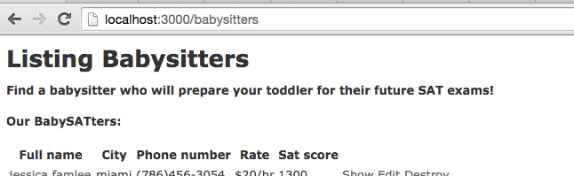

# BabySAT Rails Exercise


## Overview

Students will build, from scratch, an app that allows parents to find babysitters that will help prepare their toddlers for their future SATs.

The student is expected to start with a scaffold, then add the features necessary to fulfill the user story.

## Objectives

Topics covered:

- generating scaffolds
- configuring the `root` route
- modifying scaffolded views with dynamic content
- `where` queries and looping over collections within views
- `belongs_to` & `has_many` associations
- form validations
- nested routes

## Background 

We have been given a contract from xyz university to build an app that allows parents to find babysitters 
that will help prepare their toddlers for their future SATs. This is the final app: <a href="http://babysat.herokuapp.com/" target="_blank">BabySAT</a>.

#### The catch - we only have **1** day.

Wowza! How are we supposed to build that whole thing in one day?! Not to worry, the university said that they only need 
a working backend with minimal views.

Since we only have a day, we know that we can save time by using Rails scaffolding. This will help us build our models and generate most of the views we need. 

After a long planning meeting with the university, we've agreed to implement these features:

1. As a babysitter, I should be able to:
  - Create an account with my first name, last name, city, phone number, hourly rate, and SAT score. The SAT score is required.
  - Edit my profile.
2. As a parent, I should be able to:
  - Find a babysitter.
  - View a babysitter's profile.
  - View other babysitters located in the same city as the profile I'm viewing.
  - Leave a review for a babysitter with a message and a rating from 1 to 5.
  
  
We should now be familiar with breaking projects such as this one down like we did with TDD OOP TBD and others. The concept of OOP continues same as before but now we have a little help from Rails. The approach we will be taking to build this project is a form of TDD known as **Behaviour Driven Development**. BDD is TDD, however instead of basing tests off of functionality, our tests will be based on the clients side. For example, when I click a home page, I expect to find myself at the home page. 

The tools we will be using for this approach will be **RSpec** and **Capybara**. We should be a little more familiar with RSpec at this point, but what is Capybara? Capybara is essentailly a gem that will help test our app as if a real-world user clicking through the site.

> "Capybara helps you test web applications by simulating how a real user would interact with your app." - [Capybara gem page](https://github.com/jnicklas/capybara)


#### This will really come in handy so keep it open in a new tab:
_(Here is a cheat sheet for Capybara, visit: [Capybara cheatsheet](https://gist.github.com/zhengjia/428105))_

#### __________________________________________________________________________

## Setup

Go ahead and create a new rails app titled *babysitter_app*

We've decided to use tests with BDD to build out the backend of this application. Specifically, we will be using `Rspec` along with `Capybara`. Let's get started!

CD into your babysitter_app, open it up in your editor and visit your Gemfile. In groups :development and :test you should already see the capybara gem. Let's add  `gem 'rspec-rails', '~> 3.4'`.


Next, since we've updated our gems let's install and download them by running `bundle install`

Finally, run `rails generate rspec:install` to initialize the spec directory.

- _(For additional reading on rspec, visit: https://github.com/rspec/rspec-rails)_

- _(For additional reading on capybara, visit: https://github.com/jnicklas/capybara)_

With that, we are all setup for our tests.

#### _______________________________________________________________________________

## Walkthrough

Next, we want to set up our home page for the app: 


**Remember that our only focus is to build out the backend, we don't have to worry about design right now**


To create our homepage, we will need to set up a route, generate a controller, and create a view.

A common practice is grouping sites like a welcome, info, and contact page with a few others in a **Static** category. This is because these pages are mostly always in the same state and are **not** dynamic. So, for our Welcome page, let's start with our route.

In the routes file, add a root path for the welcome page: `root 'static#welcome'`.

If we started our rails server now we would see an uninitialized controller error. It looks something like this:


This is because we haven't generated our `Static` controller. Go ahead and generate the necessary controller along with the action we specified in our route: `rails generate controller static welcome`

Once we've completed we should be done.

**If** you get an error for a missing template that looks like this:


... then create the corresponding view file for our action.

```sh
# Terminal
touch app/views/static/welcome.html.erb
```


Once we have that completed we can start adding the features necessary to fulfill the user stories. Let's take a look:


### User stories:

Remember when the university told us what they needed? Since we are being TDD, the best way to actually write our tests is to have a very clear, step by step idea of what we wish could happen. Sort of like “writing the code we wish we had”, but with people. We've translated that to mimick what they would look like as tests so that they are easier to write.

#### Babysitter:

```txt

 1. Babysitters should be able to create an account with their first name,
                     last name, city, phone number, rate, and their SAT score.
 2. Babysitters should have to enter their SAT score before being able to create account.
 3. Babysitters should be able to edit their profiles.

Remember that computers are dumb so being thorough, this translates to:

As a babysitter,
I want to visit homepage,
          click "Become a BabySATter"
          find "Join x BabySAtTers and counting!" (should be live number)
          fill in first name with "Stephanie",
          fill in last name with "Acosta",
          fill in city with "Miami",
          fill in phone number with "(305) 388-4000",
          fill in rate with "20",
          click "Let's go!",
          find "You need to enter your SAT score!"
          fill in "SAT Score" with "1310"
          click "Let's go!"
          find "Welcome, Stephanie!"
So that I can get contacted by potential clients.
```

#### Parent:

```txt

 4. Parents should be able to go on the site and find babysitters.
 5. Parents should be able to view a babysitters profile and see their information.
 6. Parents should be able to see other babysitters that share the same city as the babysitter they are viewing.


 As a parent:
 I want to visit homepage
           find "Find a babysitter who will prepare your toddler for their future SAT exams!"
           find "Our BabySATers:"
           find "Stephanie Acosta"
           find "1310"
           find "$20/hr"
           click "Stephanie Acosta"
           find "(305) 388-4000"
           find "Other BabySATters in Miami:"
           find name, score, rate "$X/hr" of other Miami BabySATters
 So that I can book a BabySATer
    
    
    
    
Also,
 7. Parents should be able to leave a review for a babysitter which has a number rating (1-5)
                                                     and has comment body in the form of text.

 As a parent:
 I want to visit babysater/1
           click "leave a review"
           fill in "review" with "She was awesome!"
           fill in "stars" wiht 5
           click "Submit Review"
           find "stephanie Acosta"
           find "She was awesome!"
           find "Average Rating: 5"
 So that I can leave a review for my BabySATer
```


To begin, we know we will have a babysitter model. It is important that we give this model all of the necessary attributes and
don't miss anything. Think about and extract the attributes a babysitter should have. When ready, go ahead and create this Babysitter model(remember that we may scaffold). If you want to be sure you have generated the right model, click view command below.

<details>
  <summary>View correct command</summary>
   
   ```sh
   # Terminal
   rails g scaffold Babysitter first_name last_name city phone_number rate:integer sat_score:integer
   rake db:migrate
   ```
   
</details>


Once that is completed, create a `babysitter_spec.rb` file in the `spec/features/` directory.
Go ahead and create a `parent_spec.rb` and `review_spec.rb` as well. We will be using these later.

_(If you were unable to create these files or want to make sure you did it correctly, check below.)_
<details>
  <summary>Correct command for creating babysitter spec</summary>
  
  ```sh
  # Terminal
  mkdir spec/features/
  touch spec/features/babysitter_spec.rb spec/features/parent_spec.rb spec/features/review_spec.rb
  ```
  
</details>

Below you will see the starting specs for each feature that were drawn out from the user story. You will be filling in your own specs based on the features the university wanted us to implement.


Capybara works really well with RSpec and comes with it's own methods. For example, if we wanted our homepage to have "Welcome" we can use capybaras `have_content` matcher. It would look something like this:

`expect(page).to have_content('Welcome')`

So capybara would visit 'page' and look for "Welcome", returning true or false. **We should have the [capybara cheat sheet](https://gist.github.com/zhengjia/428105) open to learn from and use as reference.**

##### ___________________________________________________________________________


## Our first test!


#### 1) Babysitters should be able to create an account.

#### Babysatter specs:

Before parents can find babysitters, babysitters need to be able to create an account! 


The first feature set we want to test is for our babysitters. Notice that on the final app homepage we have links to view all babysitters, or become one. We will need to implement this.

We start by encapsulating our tests using a `describe` block that will _describe_ our feature. In this case, our feature is allowing a babysitter to create an account. Since we are using capybara, it needs to know that we are testing a feature by adding a `type: :feature` hash, this is how we activate Capybara for certain tests. Don’t read to much into it, just remember if you want to use Capybara, use `type: :feature` Here's what that looks like:

```ruby
require 'rails_helper'

describe "to create a babysitter", :type => :feature do
  it 'I should be able to visit the homepage and see link for becoming a babysatter'
  it 'should fill out form to create a account'
  it 'should see welcome message only after creating account'
  it 'should validate that sat score was entered in form'
  it 'should have live count of current babysitters'

end

```

We want to test that when a babysitter visits the homepage, there should a link that directs them to the page where they can create an account. Here's the setup:

```ruby
  it 'I should be able to visit the homepage and see link for becoming a babysatter' do

  end
```

> A homepage is the root path of any site or web application. ex: _mywebsite.com/_

When we take a look at our capybara [cheatsheet](https://gist.github.com/zhengjia/428105). We see a helper method named `visit`. This helper simply _visits_ the path you provide. Since we are visiting the homepage, our path would just be `'/'`. Now our test looks like this:

```ruby
  it 'I should be able to visit the homepage and see link for becoming a babysatter' do
    visit '/'
  
  end
```

Next, we want to set our **expectation**, we expect the homepage to `have content` "Become a BabySATter". Here's our updated test using our capybara helper:

```ruby
  it 'I should be able to visit the homepage and see link for becoming a babysatter' do
    visit '/'
    expect(page).to have_content('Become a BabySATter')
  end    
```

Finally, this content should be a link. In other words, we want to `find link` and be able to click it. For this we use capybara's `find_link` helper. Here's our updated test:
    
```ruby
  it 'I should be able to visit the homepage and see link for becoming a babysatter' do
    visit '/'
    expect(page).to have_content('Become a BabySATter')
    click_link('Become a BabySATter')
 end
  ```
  
  We can run all of our feature tests by running `rspec spec/features`. We only want to run our _babysitter_ tests, so we will be running `rspec spec/features/babysitter_spec.rb`
  
  The normal steps when testing are **Red, Green, Refactor**. Right now, we are at the red stage. We will be implementing the code necessary to make our test Green. Then, we can go back and refactor that code so that it is solid.
  
To make the first test pass, We will have to manipulating some of the views so that they have what is expected. Once you've got green for the this test, move on.

*bonus*: _make sure it's going to the right page._

#### _________________________________________________________
  
  Great! One test down. This should now be our homepage:
  
  
  
  Let's move onto our next test. 
  
  After our babysitter visits our homepage and clicks our link, the babysitter should encounter a form where they can enter their information and create their account. Here is our `it` block:
  
  ```ruby
    it 'should fill out form to create a account' do
  
    end
  ```
  
  For the first line of our test, we want to `visit` our `'/babysitters/new/'` path. (This should have been created through scaffolding)
  
  fill in the first line of our test.
  
  
  <details>
   <summary>Reveal answer</summary>
   
   ```ruby
   it 'should fill out form to create a account' do
     visit '/babysitters/new'
   end
   ```
   
  </details>
  
  Next, we want capybara to `fill in` the appropriate fields with filler information to mimick a real babysitter. This would look something like this:
  
  `fill_in 'First name', with: "Stephanie"`
  
  When we scaffolded, Rails created many things for us, including things like routes and forms. When we visit `/babysitters/new/` we could see a created form and a button. This is the form capybara will be filling out.
  
  Update our test to include `fill_in` method for every attribute a babysitter has.
  
  <details>
   <summary>Reveal answer</summary>
   
   ```ruby
   it 'should fill out form to create a account' do
    visit '/babysitters/new'
    fill_in 'First name', with: "Stephanie"
    fill_in 'Last name', with: "Acosta"
    fill_in 'City', with: "Miami"
    fill_in 'Phone number', with: "(305) 388-4000"
    fill_in 'Rate', with: "20"
  end
   ```
   
  </details>

Next, to actually submit this we want capybara to `find button` and click it. We saw that the form has a button at the bottom that should be titled "Create Babysitter". The same way capybara has `find_link`, it also has `find_button` helper that we can chain the method `click` to have capybara click this button after filling out the form. That would look something like this:

`click_button("Submit")`

Update our test to use this helper to create a babysitter.

<details>
 <summary>Reveal answer</summary>
 
```ruby
  it 'should fill out form to create a account' do
    visit '/babysitters/new'
    fill_in 'First name', with: "Stephanie"
    fill_in 'Last name', with: "Acosta"
    fill_in 'City', with: "Miami"
    fill_in 'Phone number', with: "(305) 388-4000"
    fill_in 'Rate', with: "20"
    fill_in 'Sat score', with: "1310"
    click_button("Create Babysitter")
  end
```

</details>

#### __________________________________________________________

### - Welcome message

Great! It would be really nice if babysitters received a welcome message after creating their account. Let's first write our test.

<details>
  <summary>Reveal answer</summary>

```ruby
  it 'should see welcome message only after creating account' do
    visit new_babysitter_path
    fill_in 'First name', with: "Stephanie"
    fill_in 'Last name', with: "Acosta"
    fill_in 'City', with: "Miami"
    fill_in 'Phone number', with: "(305) 388-4000"
    fill_in 'Rate', with: "20",
    fill_in 'SAT Score', with: "1400"
    click_button("Create Babysitter")

    expect(page).to have_content('Welcome, Stephanie!')
  end
  ```
  
  </details>
  
  To make this test pass, we have to think about what is handling the **creation** of each babysitter instance. In other words, what *action* is communicating, or, *controlling* this information for us. Since we are dealing with babysitters, it's safe to assume that we will be working in the *babysitters* controller. Once in this file, locate the appropriate action and try to figure out what happens after a babysitter is saved. This is where we will be working to make this test pass.

#### __________________________________________________________

##  2) Babysitters should have to enter their SAT score before being able to create account.

### - Validations


Now that we know a babysitter is able to create an account, we want it to be mandatory for a babysitter to enter an SAT Score. If we try to create a babysitter without an SAT score, we should get a custom error message "You need to enter your SAT score!". It would look something like this:


If you would like to see this in action, visit the link below and try to create a babysitter without entering a SAT score.
http://babysat.herokuapp.com/babysitters/new


 For this, we want to use rails [validations](http://guides.rubyonrails.org/active_record_validations.html) to make sure we are validating the presence of an attribute for this model. We want to make sure the SAT score is present, and we want the message to be "You need to enter your SAT score!" if it's not. Start by writing our test.

<details>
 <summary>Reveal answer</summary>
   <details>
     <summary>Are you sure?</summary>
    
 ```ruby
   it 'should validate that sat score was entered in form' do
     visit new_babysitter_path
     fill_in 'First name', with: "Stephanie"
     fill_in 'Last name', with: "Acosta"
     fill_in 'City', with: "Miami"
     fill_in 'Phone number', with: "(305) 388-4000"
     fill_in 'Rate', with: "20"
     click_button("Create Babysitter")
     expect(page).to have_content('You need to enter your SAT score!')
    end
 ```
 
 </details>
</details>
  


#### __________________________________________________________
  
### - Live count
 
 Look at us! Knocking down feature after feature. The next one we want to implement is a live count of the babysitters currently on our site. We want babysitters to see this count as they create their account. So, as a babysitter after I click 'Become a BabySATter', I should see something like 'Join x BabySATters and counting!' (_x_ being a live number). Begin with the test first.
 
 > Hint: Notice we will be visiting a page and then expecting some content to be on this page.
    
    
 <details>
  <summary>Reveal answer</summary>
  
  ```ruby
  it 'should have live count of current babysitters' do
    visit new_babysitter_path
    expect(page).to have_content('Join 0 BabySATters and counting!')
    
    babysitter = Babysitter.create(id: 2, first_name:'Michelle', last_name: 'Acosta', city: "Miami", phone_number: "(786) 232-7654", rate: 25, sat_score: 1350)
    visit new_babysitter_path
    expect(page).to have_content('Join 1 BabySATters and counting!')
  end
  ```
  
  </details>


 well as manipulating some of the views so that they have what is expected. 


Once all test are green, move forward.


#### _____________________________________________________________

Great! Our babysitter is set for now (Story number 3 was mostly taken care for us because of scaffolding).

## 3) Parents should be able to go on the site and find babysitters.


Let's move onto the parent's side of the user story. Now we step into the shoes of a parent. Our first 'feature' will be giving the parent the ability to find babysitters. So when a parent visits the homepage of our app, their should be a link title 'Find a babySATter'. Paste the following code into the `parent_spec.rb` file:

#### Parent specs:

```ruby
require 'rails_helper'

describe "navigating baby sitter", :type => :feature do

  before do
    @babysitter = Babysitter.create(id: 1, first_name:'Stephanie', last_name: 'Acosta', city: "Miami", phone_number: "(305) 388-4000", rate: 20, sat_score: 1310)
    
    Babysitter.create(id: 2, first_name:'Michelle', last_name: 'Acosta', city: "Miami", phone_number: "(786) 232-7654", rate: 25, sat_score: 1350)
    
    Babysitter.create(id: 3, first_name:'Tiffany', last_name: 'Graham', city: "Toronto", phone_number: "(416) 666-1234", rate: 30, sat_score: 1340)
  end

  it 'should find link to view all babysitters on home page' do
  end

  it 'should see headline/description on babysitter index page'
  it 'list of babysitters includes babysitter rate in proper format'
  it 'list of babysitters includes babysitter SAT score'
  it 'list of babysitters includes each babysitters full name'
  it 'babysitters name on index page should be a clickable link'
  it 'babysitters profile should include full name'
  it 'babysitters profile should include phone number'
  it 'profile should include list of babysitters whom share to same city as current babysitter'
  it 'should not include babysitters from other cities'
  it 'should see the local babysitters first name, SAT score, and rate in proper format'
end
```
  
  > What is this 'before' nonsense? What we are doing here is creating 3 instances of a babysitter before each of our tests get ran, this way we have data to test against. Test know nothing about our data, they are stateless. Also, notice how we are we are storing the first created variable in an instance variable. We are doing this so that we can use this instance throughout our tests.
  
  As you can see the skeleton for our `it` block has been made for us. We just have to set our expectations.
  
  
  <details>
   <summary>Reveal answer</summary>
   
   ```ruby
    it 'should find link to view all babysitters on home page' do
      visit '/'
      expect(page).to have_content('Find a babySATter')
      click_link('Find a babySATter')
    end
  ```
  
  </details>
  
  
#### ______________________________________________
  
### - Headline message
  
  After clicking the link from the homepage, we want to have the message 'Find a babysitter who will prepare your toddler for their future SAT exams!' at the top of the page. Here's how that would look:
  

  
  
> To see an example on the final site [click here](http://babysat.herokuapp.com/babysitters)
 
 
 <p>
   As always, begin by writing the test!
 </p>
  
  
  
  <details>
   <summary>Reveal answer</summary>
   
  ```ruby
  it 'should see headline/description on babysitter index page' do
    visit '/babysitters'
    expect(page).to have_content('Find a babysitter who will prepare your toddler for their future SAT exams!')
  end
  ```
  
  </details>
  

#### _______________________________

### - Showing information

Once we have a link that takes us to view all babysitters, we want to be able to see each babysitters full name, rate **in proper format**, and their SAT Score. How would we test for this? Sounds like we will be _visiting_ the babysitters index page, and then expecting the page to _have_ some _content_. Here is the first test expecting the page to find a babysitters full name:
  
  
```ruby
  it 'list of babysitters includes each babysitters full name' do
    visit '/babysitters'
    expect(page).to have_content('Our BabySATters:')
    expect(page).to have_content('Stephanie Acosta')
  end
  ```
  
 Add two more test to expect to find a babysitters rate and SAT score, respectively.

<details>
 <summary>Reveal answer</summary>
 
```ruby
  it 'list of babysitters includes babysitter rate in proper format' do
    visit '/babysitters'
    expect(page).to have_content('$20/hr')
  end

  it 'list of babysitters includes babysitter SAT score' do
    visit '/babysitters'
    expect(page).to have_content('1310')
  end
  ```
  
 </details>

The scaffolding should have taken care of most of this for us, but what if we wanted to make the babysitters full name a clickable link that took us to that babysitters page? Sounds like out next feature.

#### _____________________________________

### - Can I click it?

While scaffolding took care of most of the above test for us, to make the a babysitters full name a link that takes us to their 'profile', we will have to manipulate the views and make sure the link points to the correct path. How would our test look for this? Well, it sounds like we'll be _visiting_ the babysitter index page, _expect_-ing to _find_ a _link_ to _click_.

Add code to `parent_spec.rb` to test this new feature.

<details>
 <summary>Reveal answer</summary>
 
```ruby
  it 'babysitters name on index page should be a clickable link' do
    visit '/babysitters'
    click_link("Stephanie Acosta")
  end
  ```
  
  </details>
  
#### __________________________________

## 5) Parents should be able to view a babysitters profile and see their information.
  
### - Babysitter info
  
  Now that we have a way for a parent to reach a particular babysitters page, we want to make sure the babysitters profile page has the babysitters information. Let's write test for just a babysitters full name and phone number.
  
<details>
<summary>Reveal answer</summary>

```ruby
  it 'babysitters profile should include full name' do
    visit 'babysitters/1'
    expect(page).to have_content('Stephanie Acosta')
  end

  it 'babysitters profile should include phone number' do
    visit 'babysitters/1'
    expect(page).to have_content('(305) 388-4000')
  end
  ```
  
 </details>
 
 To get these tests to pass, we'll have to manipulate the views to display a babysitters full name and phone number but make sure to display **all** of the other attributes as well.
 
#### ____________________________________________
 
## 6) Parents should be able to see other babysitters that share the same city as the babysitter they are viewing.
 
### - There's enough for everyone
 
 One of the features here will be showing babysitters that share the same city as the current babysitters:


##### _Hint: you'll want to use a `where` query. (http://guides.rubyonrails.org/active_record_querying.html)_

Here is our first test:

```ruby
  it 'profile should include list of babysitters whom share to same city as current babysitter' do
    visit 'babysitters/1'
    expect(page).to have_content('Other BabySATers in Miami:')
    expect(page).to have_content('Michelle')
  end
 ```
 
 At this point we are familiar with expecting a page to `have_content`, but what if we wanted to test to make sure some content *isn't* on the page? Try to figure out how you would implement this test before revealing the answer. _Hint: it feels like we'll be visiting a babysitters show page, and expecting `to not` find content_.

<details>
<summary>Reveal answer:</summary>

```ruby
  it 'should not include babysitters from other cities' do
    visit 'babysitters/1'
    expect(page).to_not have_content('Tiffany')
  end
  ```
  
 </details>
  
 Now how can we get these tests to pass? _Hint: We have to make sure that the 'show' action knows about all babysitters. Then, we'll have to iterate through all babysitters to find which babysitters have matching city with our babysitter._
  
#### ______________________________________________
 
### - Other babysitter info
  
 Working off our last feature, we want to show these other babysitters first name, SAT score, and rate **in proper format**. Start by writing the tests.

<details>
  <summary>Reveal answer:</summary>
  
```ruby
  it 'should see the local babysitters first name, SAT score, and rate in proper format' do
    visit 'babysitters/1'
    expect(page).to have_content('Michelle')
    expect(page).to have_content('1350')
    expect(page).to have_content('$25/hr')
  end
  ```
  
 </details>

 To get these tests to pass, we'll have to make sure to display the correct attributes while iterating over these other babysitters. Our page would look something like this:
 
 


Once you've made all tests green, move forward.

#### _________________________________________________________________________

## 7) Parents should be able to leave a review for a babysitter which has a number rating(1-5) and has comment body in the form of text.


**Awesome!** We’ve knocked out two specs.

Finally, the final feature left is for a parent to be able to leave a review for a babysitter, as well as view them on a babysitters profile. This is a tougher part of the project as there won't be much aid writing the tests and making them work.

To make it so that parents can leave reviews for babysitters it means that the a babysitter _has_ reviews. This introduces _nested resources_. Meaning that things in our project will have to know what babysitter we are referring to before reaching the review we wanted to reach for that babysitter. We've had a taste of this with our landlord app. Visit this link to read a bit more about nested resources:  [nested resources](http://blog.8thcolor.com/en/2011/08/nested-resources-with-independent-views-in-ruby-on-rails/)


Copy this beginning spec into your `spec/features/review_spec.rb` file:


#### Review specs:

```ruby
require 'rails_helper'

describe "leaving a review for a baby sitter", :type => :feature do

  before :each do
    @babysitter = Babysitter.create(id: 1, first_name:'Stephanie', last_name: 'Acosta', city: "Miami", phone_number: "(305) 388-4000", rate: 20, sat_score: 1310)
    Babysitter.create(id: 2, first_name:'Michelle', last_name: 'Acosta', city: "Miami", phone_number: "(786) 232-7654", rate: 25, sat_score: 1350)
    Babysitter.create(id: 3, first_name:'Tiffany', last_name: 'Graham', city: "Toronto", phone_number: "(416) 666-1234", rate: 30, sat_score: 1340)

    @review = @babysitter.reviews.create(body: "testing", rating: 5)
  end

  it "a babysitter should have reviews" do
    expect(@review.babysitter).to be(@babysitter)
  end
end
```

For our review specs, we've set our `before` block to create a few babysitters as we did for our parent specs. We also see that we are creating a review for a babysitter because a review should _belong to_ a babysitter (just like a property belonged to a landlord). Here we expect the reviews babysitter to belong to that babysitter.

#### ________________________________________________________

### - Breaking down the pieces

Continuing the same approach we've been taking, let's write the specs one at a time.

##### - Let's start with testing for there to be a "leave a review" link on a babysitters profile page to click on.

<details>
  <summary>Reveal answer:</summary>
  
```ruby
  it "profile page should have 'leave a review' link" do
    visit '/babysitters/1'
    click_link('leave a review')
  end
  ```
  
</details>


##### - Next, let's test to make sure that when we're creating a new review, we have a place to input the body.


<details>
<summary>Reveal answer:</summary>

```ruby
  it 'should have a body for review' do
    visit '/babysitters/1/reviews/new'
    fill_in 'Body', with: "She was awesome!"
  end
 ```
 
 </details>

##### - Next, Let's make sure review also have a rating field.

<details>
<summary>Reveal answer:</summary>

```ruby
  it 'should have field for rating' do
    visit '/babysitters/1/reviews/new'
    fill_in 'Rating', with: '5'
  end
  ```
  
  </details>
  
  
##### - The review form should have a submit button.
 
 
<details>
<summary>Reveal answer:</summary>

```ruby
  it 'should have submit link/button to create a review' do
    visit '/babysitters/1/reviews/new'
    fill_in 'Body', with: "She was awesome!"
    fill_in 'Rating', with: '5'
    find("input[type=submit][value='Create Review']")
  end
  ```
  
  </details>
  
#### ____________________________________
 
### - What's your average?
 
 Now we want to be able to have the average rating for each babysitter. 

We can translate this to: an instance of the babysitter model should know it’s average rating. When we notice this happening, it means that this method will go in the `babysitter.rb` file because the method should belong to the model. Our task is to create this method that calculates the average rating and then call it on the page to make this test pass. (The rating should be a float)

To see how an average rating appears on a babysitters page visit [babySAT](http://babysat.herokuapp.com/babysitters/1)
  

<details>
<summary>Reveal answer:</summary>

```ruby
  it 'profile page should have the average rating for babysitter as float' do
    visit '/babysitters/1/reviews/new'
    fill_in 'Body', with: "She was awesome!"
    fill_in 'Rating', with: '5'
    find("input[type=submit][value='Create Review']").click
    visit '/babysitters/1'
    expect(page).to have_content('Average Rating: 5.0')
  end
  ```
  
 </details>
 
 
 
##### - Next, we want to show a babysitters reviews on their profile page.
 
 
<details>
<summary>Reveal answer:</summary>

```ruby
  it 'profile page should show review for babysitter' do
    visit '/babysitters/1/reviews/new'
    fill_in 'Body', with: "She was awesome!"
    fill_in 'Rating', with: '5'
    find("input[type=submit][value='Create Review']").click
    visit '/babysitters/1'
    expect(page).to have_content('She was awesome!')
    expect(page).to have_content('5')
  end
  ```
  
  </details>


> If you’re getting an error that says something like “reviews_url”,
it might be because our reviews controller was scaffolded.
As you can see, this action is accounting for formatting because it is trying to make our application RESTful.
However, The error occurs because the responder tries to set the Location HTTP Header on create,
but this fails on nested routes.
We will have to make the necessary adjustments and remove what we don’t need
so that it doesn’t interfere with what we’re trying to do.

#### ________________________________________________________________________________________


Once you've completed the average rating method, all that’s left is to show all reviews on the profile page. iterate through the babysitters review and display both body and rating.


If you're done with that final step, rejoice because you’ve completed the back end of this project!

## Congratulations!

#### ________________________________________________________________________________


### Bonus

- This site was designed using [Materialize](http://materializecss.com/getting-started.html), explore the documentation and try to implement the design to fulfill the university's wishes!
