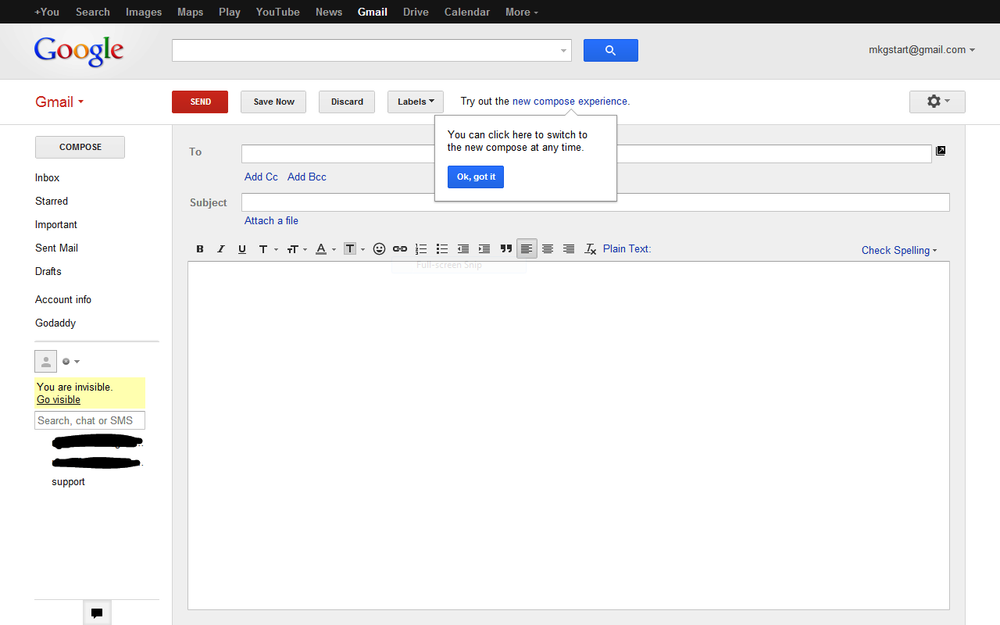

# Title
This page should have all info necessary to complete the attachment checker project.

# Estimated Time
1.5 hours

# Summary
Build the HTML/CSS/JS similar to GMail's UI for checking attachments.

# Objectives
Student will be able to:
- Attach events to elements in the DOM
- Read values from DOM form elements and use them in JS
- Alert users when something is wrong

# Pre-Requisites
- Basic HTML/CSS and full Javascript understanding.

# Walkthrough
We're going to build the UI/UX that allows us to validate that a file has been attached if the words attached, attach, or attachment are including in the body of an email:

## Steps
- __Step 1__: Code the HTML to make the form for sending an email. It should include the fields `to` as text, `subject` as text, `attachment` as a file, `body` as a textarea as well as `send`, `save` & `discard` buttons above and below the form.
-  __Step 2__: Code the CSS to make your code look kind of like the GMail form. Use the web inspector to get colors for backgrounds if you'd like. Here is one of the ones I've coded: 
-  __Step 3a__: Without using a library or framework, meaning using POJ (Plain Old Javascript) & unobtrusive JS code up logic to wait for the page to load. 
-  __Step 3b__: Once you have an event listener for page load, listen for a form submit or click on the send button.
-  __Step 3c__: In the form submit event listener check the body textarea for the string `"attach"`. Consider using regex or perhaps `indexOf` to solve this.
-  __Step 3d__: If the body textarea has `"attach"` in it then check the `attachment` form field to see if it is not populated.
-  __Step 3e__: If the `attachment` form field is not populated then Alert the user that they might have intended to attach a file. You can use `alert` in a pinch, but if you'd like to go further, make a error flash html element that is shown.
-  __Step 4__: Repeat Step 3a-3e using jQuery.
