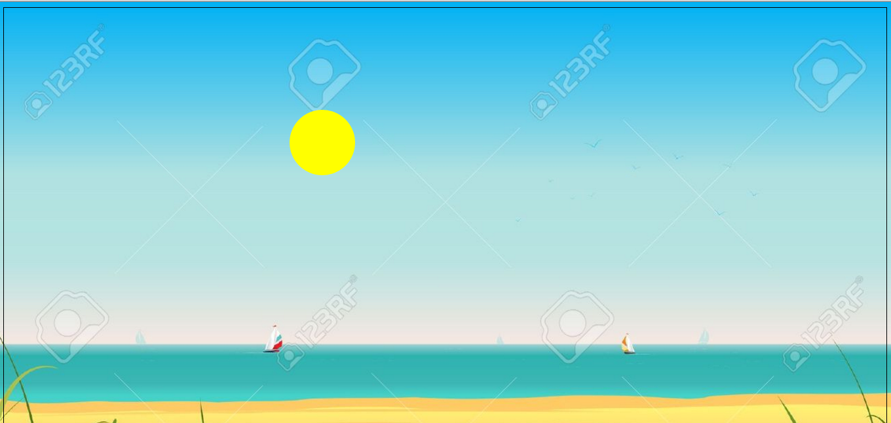

# Title
This page should have all info necessary to complete the rising sun project.

# Estimated Time
2 hours

# Summary
Build the HTML/CSS/JS to have a horizon background that has the sun moving along an arc from sunrise to sunset based on the response of an API call & the current time.

# Objectives
Student will be able to:
- Attach an window onload event to the DOM
- Perform an AJAX request using XMLHttpRequest
- Deconstruct a problem into sub problems 
- Use native JS objects such as Date, JSON 
- Traversing a nested JS object to retrieve data
- Do some math in JS
- Use JS callbacks

# Pre-Requisites
- Basic HTML/CSS and full Javascript understanding.

# Walkthrough
We're going to build a web page that makes a call to open weather map, gets information about sunrise & sunset, then uses that information along with the current time to position the sun along it's expected path. It is from the perspective of someone on the equator, looking north.

__How to approach the Hard Problem:__ 

The positioning can be done with a quadratic function that creates an reflected parabola with shallowing, the formula should look something like `sun_y = -0.035*Math.pow(percentageOfDay-52, 2)+80` but that's really annoying to explain for people with limited math background (like me). 

But if you want to do this, just calculate the `sun_x` then plug it in to the formula above (_keep reading to figure out how to get sun_x_).

The other alternative is to independently calculate the x and the y for positioning the sun in quadrant 1 (upper right hand quadrant). 

To calculate `sun_x` as a percent, `sun_x = (secondsSinceSunrise/(sunset-sunrise))*100`.

To calculate `sun_y` as a percent, you need 2 formulas, one for before noon (`(secondsSinceSunrise/highNoon)*100`) and one for after noon (`(highNoon/secondsSinceSunrise)*100`).

__Sign up for Open Weather Map API:__ We will be using it in this exercise: https://home.openweathermap.org/users/sign_up

## Steps
- __Step 1__: Code the HTML to have a sun as a div and that lives inside of a horizon div.
-  __Step 2__: Code the CSS to make your body have a background of a horizon ([here is one](http://previews.123rf.com/images/benchart/benchart1111/benchart111100426/11248988-Illustration-of-a-summer-sunny-beach-poster-background-horizon-over-water-and-sailboats-Stock-Vector.jpg)), position the bottom border of the horizon box along the edge of the ocean and the sun round and yellow (also make it positiion absolute).
-  __Step 3a__: Without using a library or framework, meaning using POJ (Plain Old Javascript) & unobtrusive JS code up logic to wait for the page to load.   
-  __Step 3b__: Once you have an event listener for page load, make an AJAX request using `XHR` to `http://api.openweathermap.org/data/2.5/weather?q={CITY_HERE},us&APPID={API_KEY_HERE}`.
-  __Step 3c__: Set up a callback function that `console.log`s the `arguments` keyword in order to understand what we're getting back. Maybe look at the data type for `this.responseText`.
-  __Step 3d__: Parse the responseText into JSON for easy access.
-  __Step 3e__: Collect the sunrise time into a variable.
-  __Step 3f__: Collect the sunset time into a variable.
-  __Step 3g__: Collect the current time, using `new Date().getTime()/1000`, into a variable.
-  __Step 3h__: Calculate the seconds since sunrise, into a variable.
-  __Step 3i__: Calculate the time the sun is at it's highest, aka noon.
-  __Step 3j__: Solve the "Hard Problem" as described above.
-  __Step 3k__: Grab the DOM element for the sun, and position the sun using left and bottom with `sun_x` and `sun_y` respectively.
-  __Step 4__: Repeat Step 3a-3k using jQuery.
