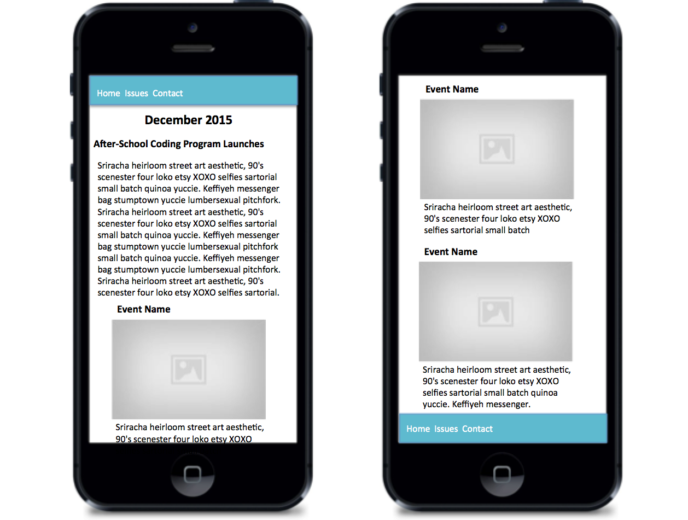

# Mobile First Design

Let's create a simple webpage using HTML and CSS. We're going to practice using a _mobile first design_ strategy, which recommends that we design for the smallest device width first, then adjust the design to accomodate larger devices.

## Mobile Design


This is where we'll start. 

When you start small, there's a lot less space to fill which, makes your life easier. Only the core elements need to be displayed *and* there are fewer options for displaying them. The design *has* to be kept clean and simple.

## Desktop View


After we've created the mobile design, we'll use media queries to adapt the display slightly to support larger devices.


## Setup

* `cd` into your wyncode directory
* Create a folder named `mobile_first`
* `cd` into `mobile_first`
* Create a file named `index.html`
* Create a sub-directory named `css`
* Within `css`, create 2 files named `style.css` and `normalize.css`
* Open the `mobile_first` directory in Atom.

## HTML

In `index.html` in Atom type `html<tab>` and it should autofill the HTML boilerplate.

### Head

Fill in the `<title>` with `Newsletter`.

Just below `<meta charset="utf-8">`, insert the following viewport `<meta>` tag:
```html
<meta name="viewport" content="width=device-width, initial-scale=1">
```

Link to your two stylesheets in the `<head>` section.
```html
<link type="text/css" rel="stylesheet" href="css/normalize.css">
<link type="text/css" rel="stylesheet" href="css/style.css">
```

Stylesheets are read from top to bottom. We want the `normalize.css` file to be read first. We'll fill in the `normalize` CSS content later.

### Body

From our mockup, we see that we need header and footer elements.

```html
<header>
</header>

<footer>
</footer>
```

Below the `<header>` we need a heading for the title of the page.

```html
<h1>December 2015</h1>
```

Below the heading there are two sections, one for the article and another for the events.

```html
<article>
</article>

<section id="events">
</section>
```

The `<article>` and `<section>` behave just like `<div>`s, but we're using more semantically appropriate elements to help search engine bots and accessibility tools (like screen readers) better understand the information being presented.

We've added an `id` attribute to the `<section>` because HTML doesn't offer a semantic element for a list of events. There should be only one element with the `id` `events` in the entire document.


The `<body>` should look like this:

```html
<body>
  <header>
  </header>

  <h1>December 2015</h1>

  <article>
  </article>
  
  <section id="events">
  </section>

  <footer>
  </footer>

</body>
```

This document isn't very complex. As your layouts grow, it's good to add more `class` and `id` attributes so that your elements are easier to style with CSS later.

### Header

The header contains navigation links for the site.

```html
<header>
  <nav>
    <ul class="my-list">
      <li><a href="#">Home</a></li>
      <li><a href="#">Issues</a></li>
      <li><a href="#">Contact</a></li>
    </ul>
  </nav>
</header>
```

The `<nav>` element behaves just like a `<div>`, but semantically represents navigation.

The `<nav>` contains a list of links. The semantic HTML elements for a list are `<ul>` (unordered list) and `<ol>` (ordered list). Each item in the list is represented by `<li>`. Don't worry too much about the fact that these lists are displayed with bullet-points. We can always change the way it looks. But a list is still a list.

Each of the items in the list are links, which are represented by `<a>` (anchor) tags. The `<a>` is nested within the `<li>`, so make sure your tags are opened and closed in the correct order.

Each of these links are _stubbed_ to point to `#`. That means the `href` is just a placeholder so we can style the links now and figure out where they go later.

### Article

While the entire page is entitled "December 2015" (according to the `<h1>`), the article also has a heading.

```html
<article>
  <h3>After-School Coding Program Launches</h3>
</article>
```

Why did we use an `h3` instead of an `h2`? Just because. We wanted something two ticks smaller rather than one. Semantically it's still a sub-heading.

The article also needs some content.

```html
<article>
  <h3>After-School Coding Program Launches</h3>
  <p></p>
  <p></p>
  <p></p>
</article>
```

A paragraph is represented semantically by the `<p>` element.

Each of these paragraphs should contain some placeholder text. You can type `lorem<tab>` to have Atom insert some _Lorem Ipsum_ text or use whichever ipsum text you like.

* [Hipster Ipsum](https://hipsum.co/)
* [Cupcake Ipsum](http://www.cupcakeipsum.com/)
* [Samuel L Ipsum](http://slipsum.com/)
* [Meet the Ipsums](http://meettheipsums.com/)

### Events

The next section contains a list of events.

```html
<section id="events">
  <div class="event">
  </div>
  <div class="event">
  </div>
  <div class="event">
  </div>
</section>
```

There is only one list of events, so it uses `id`. But there are many events, so they use `class`.

When we get to Rails later, you'll commonly see lists of things tagged (with `id` or `class`) as _plural noun_ (i.e. `events`) and individual items tagged (usually with `class`) as _singluar noun_ (i.e. `event`).

Each event has a title, an image, and a description.

```html
<div class="event">
  <h5>Event 1</h5>
  
  <p>Lorem ipsum...</p>
</div>
```

Once again, we went two ticks down to `<h5>` for the next subheading - just because. `` is used for images and `<p>` is used for the description paragraph.

Like with text, sometimes we need to start working on a layout before the content is ready. So we're using a _placeholder_ image in each event. You customize the size by changing the URL. We're going with 500px wide and 350px tall.

You can use your own preferred placeholder images instead.

* [{placekitten}](https://placekitten.com/)
* [Fill Murray](http://www.fillmurray.com/)
* [PlaceCage](http://www.placecage.com/)
* [etc.](https://www.hanselman.com/blog/TheInternetsBestPlaceholderImageSitesForWebDevelopment.aspx)

Make sure to always include an `alt` attribute for every ``. The browser won't complain, but the W3C validator will. And it helps make your page more accessible to people who use screen readers.

Don't forget to repeat the `event` `<div>` three times.

### Footer

This just in! The image of the footer is incorrect. Instead of repeating the navigation links, we want the footer to contain social media links.

First let's grab some social media company icons from [Font Awesome](http://fontawesome.io/icons/) - a great, free collection of hundreds of free icons that you can use and style as if they were any other font.

The easiest way to get started with FontAwesome is via the [BootstrapCDN](https://www.bootstrapcdn.com/fontawesome/). Click on the arrow to find a full `<link>` element we can copy directly to the `<head>`.

```html
<link href="https://maxcdn.bootstrapcdn.com/font-awesome/4.7.0/css/font-awesome.min.css" rel="stylesheet" integrity="sha384-wvfXpqpZZVQGK6TAh5PVlGOfQNHSoD2xbE+QkPxCAFlNEevoEH3Sl0sibVcOQVnN" crossorigin="anonymous">
```

Once FontAwesome is loaded into our page, search for _Twitter_ on [Font Awesome](http://fontawesome.io/icons/) to see how to add a Twitter icon to your page, then turn it into a link to Twitter.

```html
<footer>
  <ul>
    <li><a href="http://twitter.com"><i class="fa fa-twitter"></i></a></li>
  </ul>
</footer>
```

FontAwesome uses CSS to target the `<i>` tag and replace it with an icon, which is really useful because I don't know where the Twitter-bird button is on my keyboard. 

Be careful with the HTML nesting here. The `<i>` is within the `<a>`, which is within the `<li>`.

Repeat for other social media sites (e.g. Facebook, GitHub, etc.). Add a new `<li>` for every company you'd like to list.

## CSS

### Normalize

Download or copy-and-paste Normalize.css from [here](https://raw.githubusercontent.com/necolas/normalize.css/master/normalize.css).

[Normalize.css](http://necolas.github.io/normalize.css/) helps to ensure that HTML elements behave well across all browsers, particularly old and buggy ones. You may not notice much of a difference in Chrome after you include it. Check the comments in the source code for more information about all the different things it tries to fix for you.

### Style

#### Organization
Our own styles will be read from the `style.css` file.

Large CSS files can become overwhelming and complex to navigate. CSS selectors are global, and global variables are problematic. For example, if you lose track of which `id`s and `class`es you've already used, you may end up accidentally changing the style of similarly-tagged elements.

There are a number of CSS selector naming conventions and techniques you can use to help keep things under control.

* [BEM](http://getbem.com/)
* [OOCSS](https://www.smashingmagazine.com/2011/12/an-introduction-to-object-oriented-css-oocss/)

We're going to keep things simple today. Our document has some sections that need styling.

* header
* title
* article
* events
* footer

Let's use this organizational scheme inside our `style.css`.

```css
/* header */

/* title */

/* article */

/* events */

/* footer */
```

These comments will help you stay organized as your CSS grows. You'll be able to quickly jump to the CSS associated with a particular section of the page.

#### Reset

When you start styling, it's important to understand that every browser ships with a _User Agent Stylesheet_. This stylesheet is the reason why, without any CSS defined, your page already has some minimal styling: 

* `h1-h6` are different sizes
* `ol li`s have bullet points
* `a`s are blue (purple when clicked on) and underlined

Just like an artist doesn't want to start painting on a canvas that already has paint on it, a CSS designer may want to start with a blank canvas. A _CSS Reset_ is a section of CSS dedicated to undoing the default User Agent Stylesheet.

There are many [CSS Resets available](https://perishablepress.com/cssresetr/). Some are stronger than others. We're going to write our own today. Over time, as you become a better front-end developer, you'll develop a list of your favorite overrides.

Here are the resets we'll be using today. Place them in a new commented section at the top of your stylesheet.
```css
/* reset */

* {
  box-sizing: border-box;
}

li {
  list-style-type: none;
}

a {
  text-decoration: none;
}

/* header */
/* ... */
```

The `*` selector selects all elements on the page. The [`box-sizing`](https://css-tricks.com/international-box-sizing-awareness-day/) style helps to guarantee that CSS `width`s makes sense - that the content, margin, and padding are all included by default.

The `li` selector selects all `<li>` elements. The `list-style-type: none;` removes the bullet-point (or number in an `<ol>`). Lists are very common in web design, but bulleted- and numbered- lists aren't. So we'll make the default `<li>` undecorated and add it back in later on a case-by-case basis if we need it.

The `a` selector selects all `<a>` links. The `text-decoration: none` removes the <u>underline</u> style. Underlining links isn't cool anymore. (Soooooo 90's!)

#### Header

```css
/* header */

header {
  /* you can use a color-dropper in Chrome DevTools to extract this color code */
  background: #5ebacf;
}

header a, header a:visited, header a:active {
  color: white;
}

header a:hover {
  color: lightgrey;
}

header ul {
  margin: 0;
  padding: 0;
  display: flex;
}
```

It's useful to give links a custom color when you hover over them so users know that a link is interactive. It's also useful to style the "clicked" color - the default browser color may not be what you expect.

The `<ul>`, like many HTML elements, have default `margin`s and `padding`s in the User Agent Stylesheet. Some CSS resets will zero those out for us. We're going to do it ourselves today.

Simply setting the `<ul>` `display` to `flex` makes the list display horizontally because the default `flex-direction` is `row`. This should be the third technique we've learned for making links go horizontal, along with:

* `display: inline`
* `float: left`

Let's add some space around our `<li>`s.
```css
header li {
  padding: 0.5em 0 0.5em 1em;
}
```

#### Title

The title of the page ("December 2015") should be centered.

```css
/* title */

h1 {
  text-align: center;
}
```

#### Article

Let's add some space around the article text.

```css
/* article */

article {
  padding: 0 0.75em;
}
```

It's good practice to make sure text doesn't butt up against the edge of the screen or other elements.

#### Events

On the Desktop, we want the events to flow horizontally. But on mobile, we're ok with them flowing vertically, which is the default. So we don't have to change anything for the list.

However, we do want each event to have some padding (on both mobile and desktop). And, even though the images are supposed to be 500px, we want them to behave well on small mobile screens.

```css
/* events */

.event {
  padding: 0.75em;
}

.event img {
  width: 100%;
}
```

#### Footer

Finally we need to configure the `footer` background-color to match the header so our links show up.

```css
/* footer */

footer {
  background: #5ebacf;
}
```

Ok, this looks great! (On an iPhone anyway.)

#### Media Queries

There are many sizes between iPhone and desktop, but for this lesson we're only going to look at adapting our mobile design for a desktop.

At the bottom of `style.css`, define a media query block that will override the styles in the sheet when the width of the screen grows past 768px (which is the width of an iPad in portrait orientation).

```css
@media only screen and (min-width : 768px) {

}
```

Within this block, we'll inherit all the CSS we've already written. We don't have to repeat ourselves. We only have to write the CSS that changes.

Organize the CSS within your media query the same way you organized it outside the media query.

```css
@media only screen and (min-width : 768px) {
  /* header */

  /* title */

  /* article */

  /* events */

  /* footer */

}
```

We won't be changing everything when the screen grows wide. The only section that changes is the events list.

```css
  /* header */
  /* title */
  /* article */
  /* footer */

  /* events */
```

As the screen grows wide, the events grow huge. Instead of having huge events and stacked on each other, I would like them to display horizontally next to each other.

Modify the `#events` `section` to be a _flexbox_. The default `flex-direction` of a flexible-box is `row`.

```css
/* events */
#events {
  display: flex;
}
```

Wow that was really easy!

Play with resizing the screen (either the entire window or using Chrome DevTools) to see the events switch between being stacked vertically and horizontally.

## Conclusion

And just like that we have a simple responsive site built with HTML and CSS that looks great on mobile and desktop. No templates or frameworks required, just good ol' fashioned design principles.

With this simple foundation you're now prepared to go on and build more complicated structures from scratch or add in frameworks as needed. Happy coding!!!

## Bonus Tasks

1. The footer should be styled like the header: horizontal and padded.
1. Actually, the header and footer should start vertical (and centered) and flip to horizontal when the screen goes wide.
1. The header needs a drop shadow.
1. DRY the repeated CSS.
1. Change the flexbox container to use `justify-content` values `space-around` and `space-between` to see the difference.
1. Demonstrate in CodePen how you can refactor these styles in SCSS and SASS using nesting (for the sections) and variables (e.g. for the background color).
