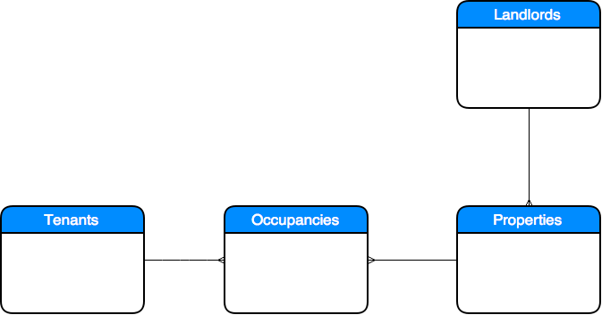

# Modeling with RSpec

If you've ever not known where to start, this hackathon is for you. We'll build practice with the first steps in developing an app: modeling! You'll be following a test driven development process, as every line of code that you write will start with a line of tests. Some of these tests will be provided by us, but some you'll have to write on your own as well.

This hackathon covers the very first steps in a rails project, and uses basic RSpec tests. In the next hackathon, you will begin to write more advanced, customized specs to help you test higher level app functionality.

## Step 0: Dependencies

We are going to use a gem called 'rails-erd'. Rails erd does generate a PDF document containing an Entity Relationship Diagram of your current database. Please check on the ([detailed installation instructions](http://voormedia.github.io/rails-erd/install.html)).

Add Rails ERD as a plugin to your Ruby on Rails 4 application. In your Gemfile...

```
group :development do
  gem "rails-erd"
end
```
In the console:

```
bundle install
```

Generate your first diagram
You now have a new Rake task in your application. Generate an up-to-date model diagram with...

```
rake erd
```

Done!

Now you have in your directory a ERD.pdf to view your diagram.

In the console:
```
open erd.pdf
```

Please ensure that Postgres is running!
Now everytime you add a model and run your migrations, you can generate a new entity relationship diagram.

## Step 1: Concept

The first and most important step in building any app is developing a solid and grounded concept. Today, we're going to be building the backbone of a property management app for landlords to keep track of tenants. We can immediately begin to see our model diagram forming:


Our app is going to need to allow landlords to manage each of their properties, following that train of logic:


Now is where things get tricky. We know that a tenant will live in a property, so it might be tempting to draw a direct relationship between properties and tenants. Unfortunately, this will not work as we want it to.

Tenants move between properties. When a tenant is staying in a property, they will have contracts, rent, issues, etc. associated with their stay. They can move out and another tenant will move in, meaning that rent and contracts might change to reflect the new tenant's stay. We don't want to destroy the records of the old tenant, as they may still owe bills, and those records need to be kept!

It seems like the right move to do here is to have a model represent a tenants 'stay', in more technical terms, we need a join table representing the relationship between tenants and properties. Let's call it occupancy:



This represents a solid backbone for our app. The functionality for tracking contracts, issues, payments, etc. can all be associated with this occupancy join table.


We won't go this far for now though. Let's get to work on implementing this model diagram:


## Step 2: Preparing your Models

Before we can do _anything_ related to views/controllers/etc, we have to get our models implemented as planned. Let's begin:

```rb
# In Terminal
rails new property_manager -T
```

The `-T` up there simply tells rails to skip installing MiniTest, because we're going to be using RSpec for this breakout. cd into your new app and before you begin, let's add two gems to our Gemfile:

```rb
# In Gemfile
group :development, :test do
  # Call 'byebug' anywhere in the code to stop execution and get a debugger console
  gem 'byebug'
  gem 'rspec-rails'
  gem 'shoulda-matchers', '~> 2.8'
end
```

Shoulda matchers ([shoulda.io](http://www.shoulda.io/)) provide a quick set of _matchers_ that we can use to quickly test for certain things in Rails. We'll explain a more about them when they come up a bit later.

```rb
# In Terminal
bundle install
```

Now, let's install rspec:

```rb
# In Terminal
rails g rspec:install
```

You'll notice RSpec generated a new `spec` folder where it will place test files for each of our models and controllers. We can also add our own files here. Any files ending in `_spec.rb` will be run when we type `rspec` into the terminal.

Now that we've got everything setup, let's get started! Let's start by creating our Landlord:

```rb
rails g model landlord
```

In addition to the `landlord.rb` model file and migration file, Rails automatically created a `landlord_spec.rb` file inside our `spec` folder. This is where we're going to write our tests for Landlords!

Referring back to our ERD (entity relationship diagram), we know that a Landlord has many properties. Let's first define ourselves a test that verifies that landlords have many properties.

Replace the `pending` line with the following:

```rb
# In spec/landlord_spec.rb
RSpec.describe Landlord, type: :model do
  subject(:landlord) { Landlord.new }

  it { is_expected.to have_many(:properties) }
end
```

The first line prepares our `subject`. Basically, this means we can use the single-lined expectation syntax you see in the second line. This is following [this principle](http://betterspecs.org/#subject).

What's on the right hand side of the second line, `have_many(:properties)`, is our _matcher_. Matchers are the test we run against the _subject_. Normally, you've seen this syntax `expect(subject).to matcher`, but we defined our subject separately in the first line. Most importantly though, don't sweat these details. Just start typing and you'll build an understanding of them the more you use them.

Now, let's run our tests and begin working our way through a series of errors to make it pass!

```rb
# In terminal
rspec
```

>**Challenge 1** Make this test pass!

What's next? Follow the ERD! Let's work on the property now.

Add the following line to our tests for properties:

```rb
# In spec/property_spec.rb
subject(:property) { Property.new }
```
>**Challenge 2** We've helped you prepare the subject of our tests for Properties, now add another test to verify that properties can reference their landlord. In other words, if I open rails console, I want `Property.new.landlord` to not throw an error, and instead connect me to the landlord for that property.


>**Challenge 3** Make that test pass!

Properties have one more association according to our erd. They have many occupancies!

>**Challenge 4** Add the test to verify that something like `Property.take.occupancies` would work to return all occupancies associated with the retrieved property.

>**Challenge 5** Make that test pass!

Continuing to follow that ERD, we now need to test & build the Occupancy model. Occupancy represents the relationship between a tenant and property making it a join table. This means it has two foreign key columns in our database, one referencing a tenant and one referencing a property. To make rails aware of these two columns, we simply need to define an association in our models!

>**Challenge 6** Build the test to verify the association from a occupancy to a property.

>**Challenge 7** Make this test pass!

>**Challenge 8** Build a test to verify the association from a occupancy to a tenant.

>**Challenge 9** Make this test pass!

And finally, on to our Tenants.

>**Challenge 10** Build a test to verify the association from a tenant to a occupancy.

>**Challenge 11** Make this test pass!

After we've accomplished all this, we've successfully built the backbone for our app! If we launch rails console, we could manually verify that all of our associations work as expected.

## Bonus challenges!

We want the following to work:

```rb
# In rails c

# our landlord steve
steve = Landlord.create

# our landlord's first property, 'house'
house = steve.properties.create

# a tenant, mark
mark = Tenant.create

# 'mark' moves in to 'house'
house.occupancies.new(tenant: mark)

# We want to be able to get at all the tenants that have lived in 'house':
house.tenants.include? mark #=> should be true
```

Essentially, we want to be able to go _through_ occupancies to reach tenants directly from a property.

> **Bonus Challenge 1** Build a test to verify this relationship.

>**Bonus Challenge 2** Make this test pass.
