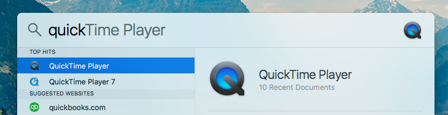
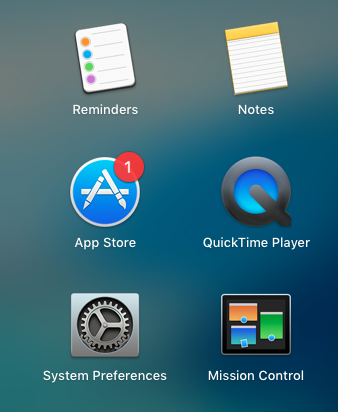
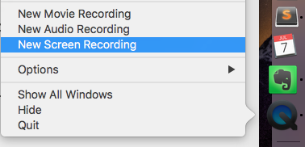
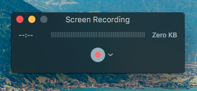
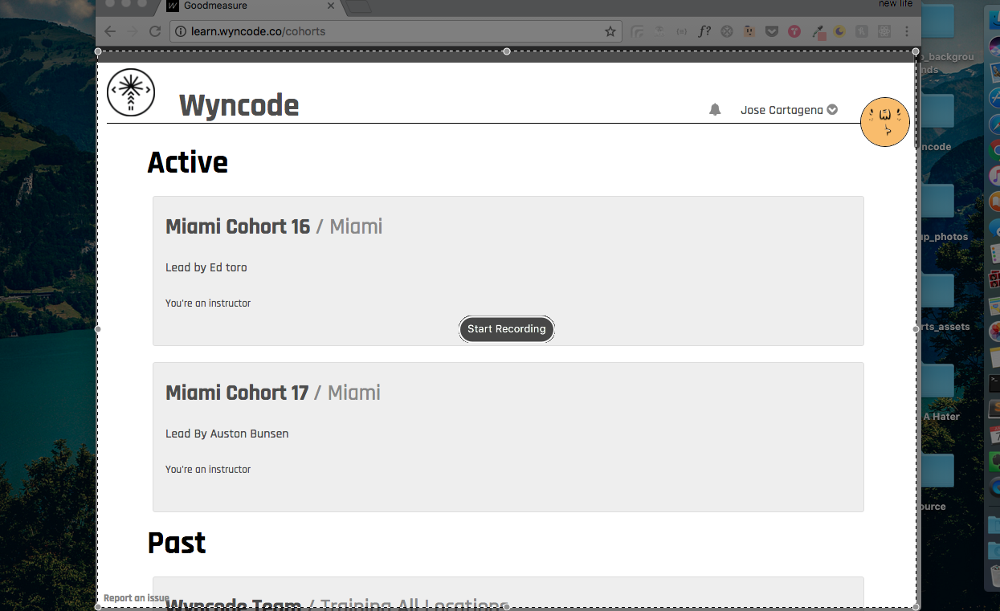

# Screen Capture Walkthrough

## Objective
Students will be able to record a video demo of their application.

## Requirements
- Mac OS

## Instructions

#### 1) Open Quicktime 

- Command + Spacebar
    

### OR

- Open Launchpad by pressing **F4** and click on Quicktime icon

___

#### 2) Right click on Quicktime icon on dock menu and select **New Screen Recording**

___

#### 3) Click on the red record button in the small window that pops up.

___

#### 4) Follow instructions to either record the entire screen by clicking or click and drag to select a portion of the screen to record.

___

#### 5) To stop the screen recording click the stop icon located in the menu bar at the top of the screen.

___

#### 6) Edit your video using iMovie for a magical demo!

