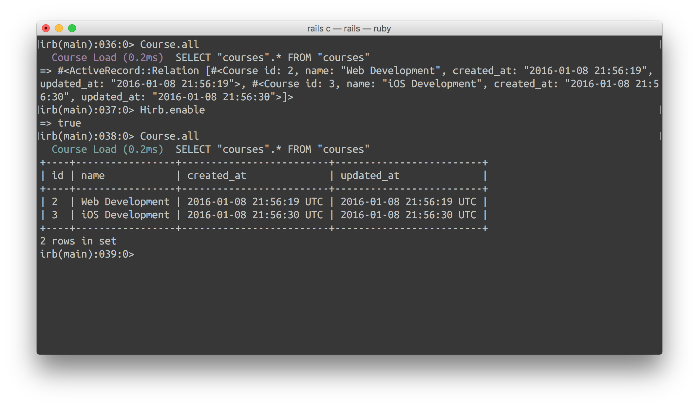
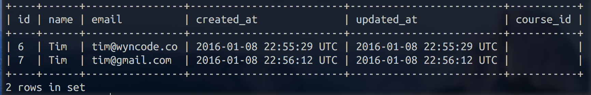

# Models 1: CRUD

## #1
Before you begin practicing CRUD operations, let's make it easier to visualize your database by installing and using a gem.

Add 'hirb' as a gem in your class_roster app's Gemfile, then run bundle install.

Afterward, jump into rails c and run User.all, you'll get something much like we did in lecture. However, if you run Hirb.enable and then try calling User.all again, youll see the result displayed in a table, from right within Rails' console!

Submit "true" when you finish this step and the gem is working as expected.



<details>
  <summary>View feedback:</summary>
  For those curious, Hirb monkeypatches the "inspect" method on ActiveRecord Objects, meaning that when irb "p"s them out, we see a nicely formatted table instead of the default object display.
</details>

## #2
Practice creating models! Use both the `.new()` & `.save()` methods that we discussed in the lecture as well as the `.create()` method.

1. Create two courses, one named "Web Development" and one named "iOS Development". 
2. Create these users in your database: "Stefanie", "Tim", "Tim"(yes, another one!), "Jacob", & "Sam". They should all have unique emails.

Submit "True" when you've used both `.save()` and `.create()` to successfully add a few records to your databse. (Remember to use `.all()` to check your tables and verify that everything is there as expected)


<details>
  <summary>View feedback:</summary>
 Active Record objects can be created from a hash, a block or have their attributes manually set after creation. The new method will return a new object while create will return the object and save it to the database.

For example, given a model User with attributes of name and occupation, the create method call will create and save a new record into the database:

```ruby
user = User.create(name: "David", occupation: "Code Artist")
```

Using the new method, an object can be instantiated without being saved:

```ruby
user = User.new
user.name = "David"
user.occupation = "Code Artist"
```

A call to `user.save` will commit the record to the database.
</details>

## #3
There are two "Tims". You wish to retrieve all users with the name "Tim" from the database. 

Hirb should produce a table like this once you've done it correctly. 

Which ActiveRecord Query method did you use to accomplish this?



<details>
<summary>View Feedback:</summary>
Remember that `.find_by()` will only ever return one record. Use`.where()` when you wish to search for all the instances of a record whose attributes match what you're looking for.
</details>

## #4
Keeping track of two users with the same name is confusing. Change their names to be "Tim R" and "Tim S". 

For the first Tim, use the `.save` method. For the second one, use the `.update` method. 

Remember to use our Hirb-table-empowered .all to verify that your changes are as expected.

<details>
<summary>View Feedback:</summary>
Once an Active Record object has been retrieved, its attributes can be modified and it can be saved to the database.

```ruby
user = User.find_by(name: 'David')
user.name = 'Dave'
user.save
```

A shorthand for this is to use a hash mapping attribute names to the desired value, like so:

```ruby
user = User.find_by(name: 'David')
user.update(name: 'Dave')
```
</details>

## #5
Actually, we don't like Tim S. Destroy him.

<details>
<summary>View Feedback:</summary>
Once retrieved, an Active Record object can be destroyed which removes it from the database.

```ruby
user = User.find_by(name: 'Tim S.')
user.destroy
```
</details>


