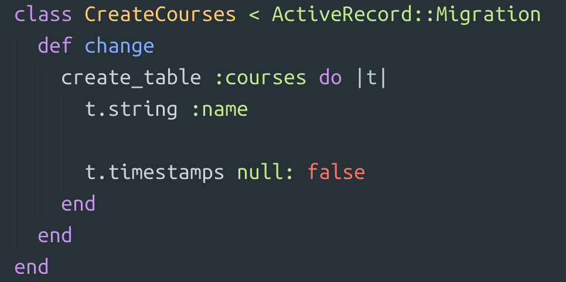
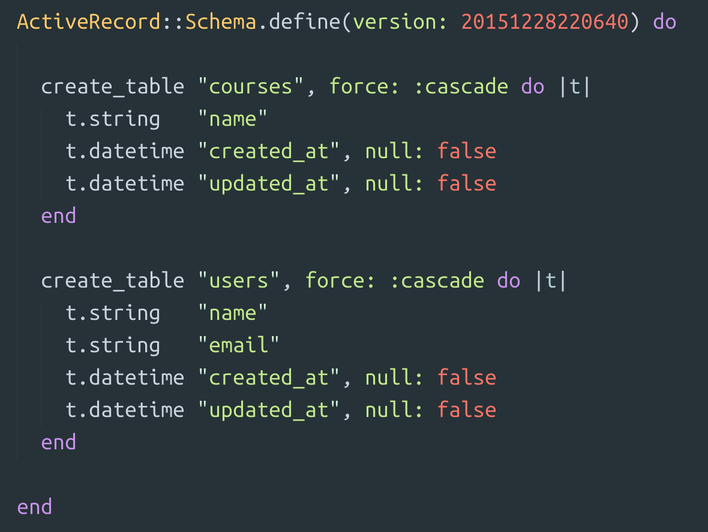

# Models 1: Generating a Model

## #1
Using Rail's generate command, create a new model named course. It should have only one column; a name column. Check out the two files that Rails created and compare them to what we saw earlier with users. 

The CreateCourses migration should match what is shown here.

  
View feedback:

  Rails creates both a model and a migration when we generate a model. Every model needs a table in the database for it to store it's data. The migration contains the instructions to create the necessary table in the databse.

## #2
Our schema represents a map of our database, like a schematic. If Rail's generate command created a migration, why doesn't our database reflect this change? 

Execute the instructions contained in your migration file so that your schema matches what is shown here.

  
View feedback:

  You need to run rake db:migrate to execute any new migration files since the last time you ran your migrations. In this case, you executed the instructions in your CreateCourses migration, which created a table named courses in your database. 

