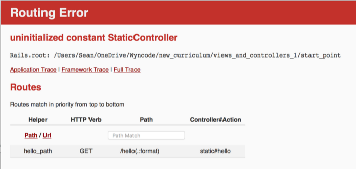
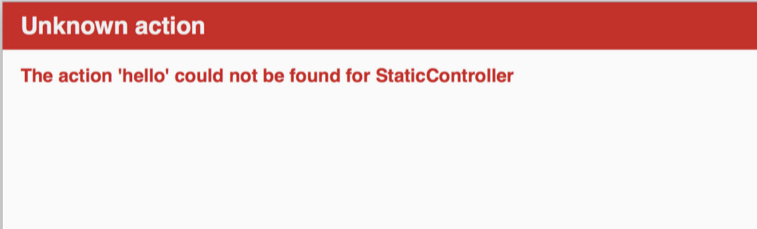
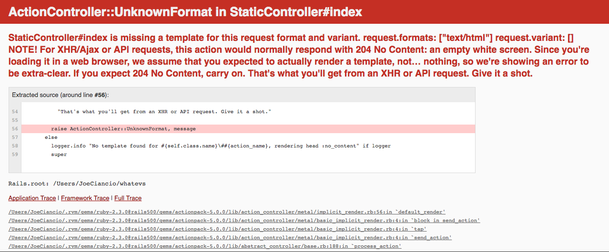

# Views and Controllers: The Request/Respons Cycle 1

## #1
Which controller file contains the action that this route will call?

```ruby
put 'users/:id' => 'users#update'
```
Choices:

* A) put_controller.rb
* B) update_controller.rb
* C) users_controller.rb
* D) id_controller.rb

<details>
  <summary>View feedback:</summary>
  Using the correct syntax the controller will be listed here in a route `put 'users/:id' => 'users#update'`
</details>

## #2
Which route should render a view for the index action in the users controller?

* A) `get '/users' => 'users#index'`
* B) `get '/users' => 'users#show'`
* C) `patch '/users' => 'users#index'`
* D) `get '/users' => 'index#users'`

<details>
  <summary>View feedback:</summary>
 The route should be a GET (`get 'users/' => 'users#index'`) request to the users controller(`get 'users/' => 'users#index'`) looking for the action 'index'(`get 'users/' => 'users#index'`)
</details>

## #3
I am getting the given error, why?



* A) The controller for the route I am requesting doesn't exist
* B) The action in the controller I am requesting doesn't exist
* C) The view I am requesting doesn't exist
* D) The route I am requesting doesn't exist

<details>
<summary>View Feedback:</summary>
A) The router is looking for a controller of a specific name(in this case `static_controller.rb`) but can't find a controller with that name.
</details>

## #4
I am getting the given error because...



* A) The controller for the route I am requesting doesn't exist
* B) The action in the controller I am requesting doesn't exist
* C) The view I am requesting doesn't exist
* D) The route I am requesting doesn't exist

<details>
<summary>View Feedback:</summary>
B) The router can find the appropriate controller, but when it looks for that action in the controller it can't find an action(method) with that name
</details>

## #5
I am getting the given error because...



* A) The controller for the route I am requesting doesn't exist
* B) The action in the controller I am requesting doesn't exist
* C) The view I am requesting doesn't exist
* D) The route I am requesting doesn't exist

<details>
<summary>View Feedback:</summary>
C) Missing template error happens when the controller action looks to render a view, and that view is missing. So naturally we need to create the associated view to fix this error!
</details>


