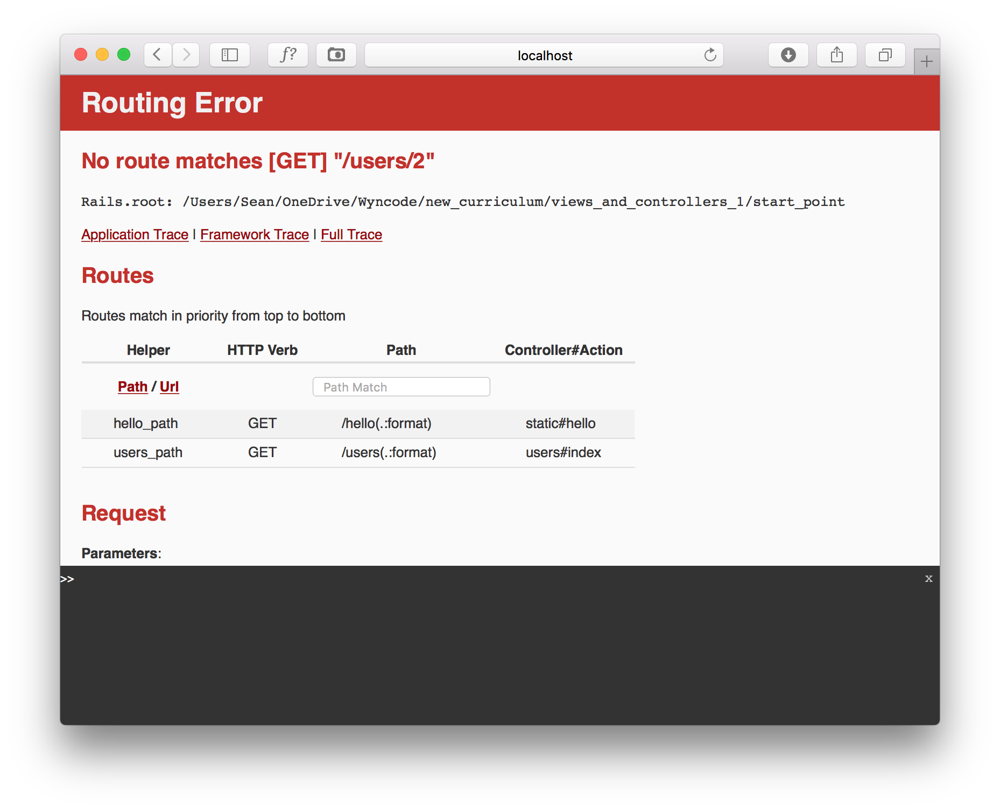
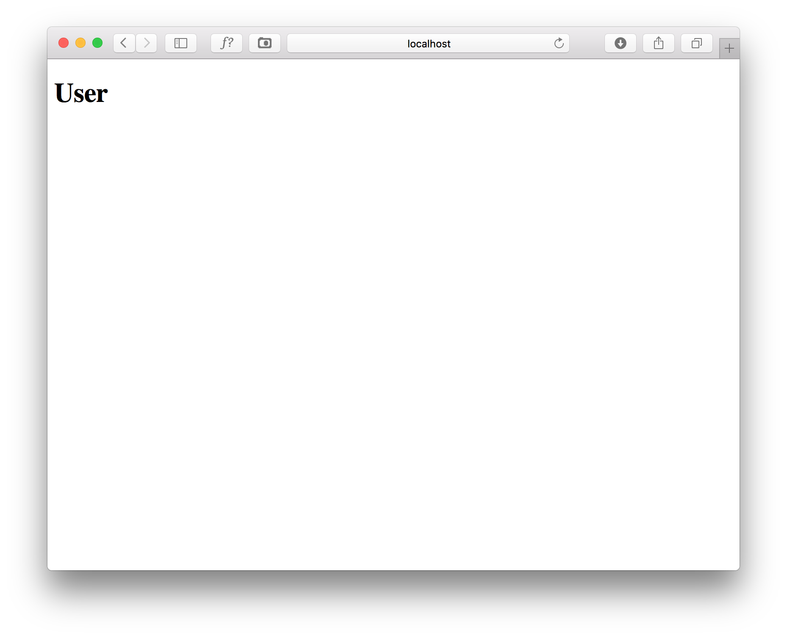
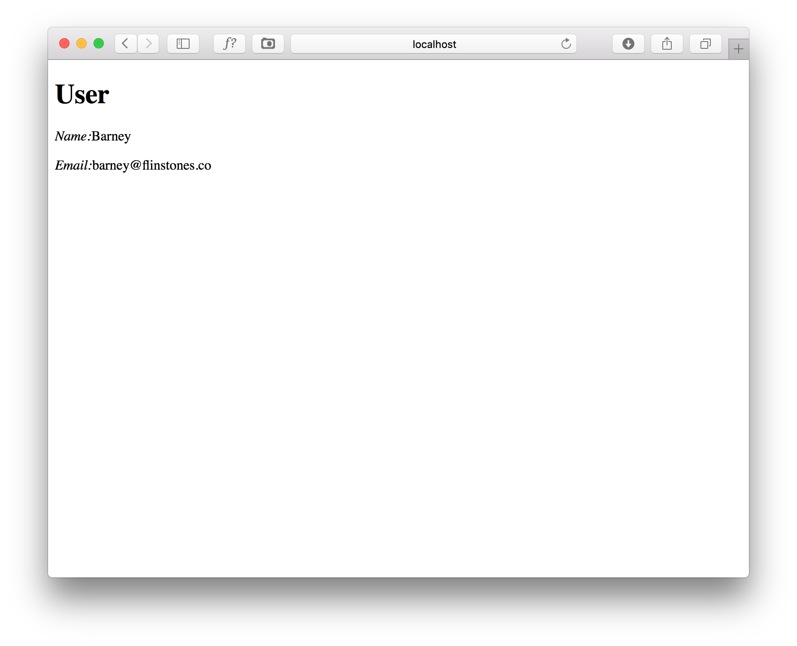

# Views and Controllers: The Request/Respons Cycle 1

## #1
It's always good to start your code with what you wish was true! To kick it off, visit http://localhost:3000/users/2 

You should see an error like the picture shown. Fix that error.



<details>
<summary>View Feedback:</summary>
In config/routes.rb, you should have defined:

```ruby
get 'users/:id' => 'users#show'
```

"show" is the conventional name for the controller action responsible for displaying the information of a single record.
</details>

## #2
Using your app's errors as your guide, define the 'show' action in your UsersController and the create the view template.

Add a "User" h1 tag to this page, then submit true when your browser matches the picture shown.



<details>
<summary>View Feedback:</summary>
After defining the route, you have to define the appropriate controller action (show), then create the appropriate view template (`users/show.html.erb`), before you are ready to begin writing the logic associated with this action.
</details>


## #3
Finally, use the params hash to find the user with the requested id.

In your view template, use that variable to display the User's name and email on this page. 

Submit true when you are able to create something similar to the picture shown here.



<details>
<summary>View Feedback:</summary>
The appropriate user can be retrieved with `User.find(params[:id])`, then can be used in our view with ERB tags such as `<%= @user.name %> and <%= @user.email %>`
</details>
