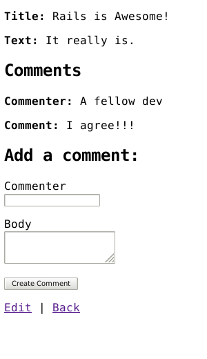

# Week 6 (1-1)

______

## Rails
______

Today we will building a blogging application using Rails.

#### Models:

- `Post`
- `Comment`

For our blogging app, we want to have posts, and each post should have many comments. A comment should belong to a post.

______


#### Tasks: 

1. Draw an ERD (use draw.io or pen/paper)
2. Create a new rails app called `blog_app`
3. Create both  `Post` and `Comment` models with appropriate attributes/fields based on this example blog image:
___  


___  

4. Create the proper association between post and comments.
5. From the Rails console, create some posts and associated comments.
6. Post and Comment should have a `title` and `body`. If your Post or Comment model is missing any of these attributes (or has differently named attributes), add them by generating a migration.
7. Find the necessary command needed to _seed_ our database with this data:


<details>
  <summary>Click here when you're ready to fill in your seed file</summary>
  
```ruby

post = Post.create(title: 'Success!',
                  body: %(Lorem Khaled Ipsum is a major key to success.
                         Put it this way, it took me twenty five years to get these plants,
                         twenty five years of blood sweat and tears,
                         and I'm never giving up, I'm just getting started.
                         We the best. Bless up. In life there will be road blocks
                         but we will over come it.
                         Stay focused. We don't see them, we will never see them.
                         How's business? Boomin. Let's see what Chef Dee
                         got that they don't want us to eat. Surround yourself with angels,
                         positive energy, beautiful people,
                         beautiful souls, clean heart, angel.")
                         )


other_post = Post.create(title: 'Chef Dee',
                         body: %(Let's see what Chef Dee got
                         that they don't want us to eat.
                         The first of the month is coming,
                         we have to get money, we have no choice.
                         It cost money to eat and they don't want you to eat.
                         To be successful you've got to work hard, to make history,
                         simple, you've got to make it. Don't ever play yourself.
                         We don't see them, we will never see them. I'm up to something.
                         Special cloth alert. It's on you how you want to live your life.
                         Everyone has a choice. I pick my choice, squeaky clean.)
                         )

4.times do
  post.comments.create(title: 'Nice post!',
                 body: %(They don't want to see you succeed!
                          Keep up the great work, reading your blog post
                          was very inspirational!)
                          )
end


3.times do
  post.comments.create(title: "I'm a fan",
                 body: %(At first I was a part of they
                       I didn't want to see you suceed,
                       now I'm on board! LIOOONN!)
                       )
end

3.times do
  other_post.comments.create(title: 'Shout out to Chef Dee!',
                 body: %(Chef Dee is the backbone to the household.
                        She holds it down!)
                        )

end


comment_one = Comment.find(1)
comment_two = Comment.find(2)
comment_three = Comment.find(3)
comment_four = Comment.find(4)
comment_five = Comment.find(5)
comment_six = Comment.find(6)
comment_seven = Comment.find(7)
comment_eight = Comment.find(8)
comment_nine = Comment.find(9)
comment_ten = Comment.find(10)

odd_comments = [comment_one, comment_three, comment_five, comment_seven, comment_nine]
even_comments = [comment_two, comment_four, comment_six, comment_eight, comment_ten]


odd_comments.map { |comment| post.comments << comment }
even_comments.map { |comment| other_post.comments << comment }

post.save
other_post.save

puts "Successfully executed seeds file"

```

</details>


8. Fill out the view pages for posts index and and post show. Index should atleast show every post's title and body. The show page should show an individual post's title and body. Remember to follow RESTful practices! Your paths should look something like `/posts` and `/posts/1` respectively 

_____

**BONUS**: Add feature for creating a post and a comment through your app's UI so we don't have to create them through rails console.
