# Trio Project

Another email came in from your PM.

```html
from:	 Project Manager <pm@wyn.co>
to:	 Junior Dev <jrdev@wyn.co>
subject:	Rails Project

Junior Dev,

Great job getting that ToDoList app cranked out so quickly! The boss was very impressed.

You made it look almost too easy. The boss thinks you’re ready for a bigger challenge. Below are three projects we’ve had in our backlog for a while. He wants to see you complete one of them by the end of the week. Some new investors are coming to visit and the boss would like to demo what we’ve been working on.

That shouldn’t be a problem, right?

Thanks!
P. Manager
```

Moral of the story: What’s the reward for making tremendous efforts to finish an impossible project on deadline? Even more work.

The three project descriptions are below. Rather than keeping things open-ended, we’re going to give you a lot of technical direction this time. Just follow the steps and you’ll be fine.

The projects are ordered by difficulty. The easier is first, the hardest is last. Pick the level you’re most comfortable with.

## Easy: API Project

Create a webapp that pulls it’s data from an API. I recommend using the same API you used for the Ruby Web Clients homework.

Here’s an example app.

```sh
$ rails g controller Github index
```


Add the httparty gem to the end of your Gemfile.

```ruby
# In Gemfile
gem 'httparty'
```

Since I changed Gemfile, I need to run bundler again.

```sh
# In Terminal
$ bundle install
```

The Ruby web client code can go in my controller.

```ruby
# In app/controllers/github_controller.rb

class GithubController < ApplicationController
  def index
    @profile = HTTParty.get("https://api.github.com/users/#{username}").parsed_response
  end
end
```

Remember that all a controller has to do is create an instance variable. The view takes it from there. The Rails controller generator created a view file for the index action. So that’s where our view code goes.

```html
# In app/views/github/index.html.erb
<h1>Github</h1>
<dl>
  <% @profile.each do |key, value| %>
    <dt><%= key %>
    <dd><%= value %>
  <% end %>
</dl>
```

Once I have the data I want in `@profile`, I can use it in ERB. Remember that code that I want to run, but don’t care about the output, goes in `<% %>`. Code whose output I care about goes in `<%= %>`.

We can test this view in a browser.

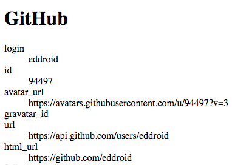

To get this to load at the root, we need to update our routes.

```ruby
# In config/routes.rb

Rails.application.routes.draw do
  get 'github/index'
  root 'github#index'
  # … lots of comments ...
end
```

The first route was added by the generator. I added a root route. Now I can load my site like this.

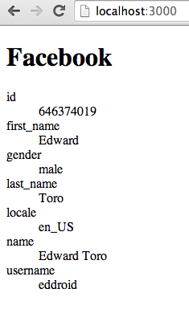

And that’s it. Now it’s your turn. Create an webapp that, on load, accesses data from an API and generates a web page. Good luck!

**Bonus Task:**

Create a non-ActiveRecord based model and update your controller to look like this.

```ruby
# In app/controllers/github_controller.rb

class GithubController < ApplicationController
  def index
    @profile = Github.get_profile('eddroid')
  end
end
```

The Github class should encapsulate all the code related to accessing the GitHub API. This helps enforce the Rails design principle of having "thin controllers" and “fat models”. Keep your controller code simple and hide all the complexity in the model.

## Medium: Photogur Project

This project will create a clone of Imgur called Photogur. It allows users to re-post images they find online.

Let’s start a new app.

```sh
$ rails new photogur
$ cd photogur
```

We want an app to manage Pictures, so let’s generate a scaffold for it and migrate.

```sh
$ rails g scaffold Picture title url --javascript-engine=js --stylesheet-engine=css
$ rake db:migrate
```

When we run the server, we get the scaffold we expect at [http://localhost:3000/pictures](http://localhost:3000/pictures). Let’s create a picture with a URL:

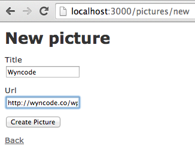

I used Chrome Developer tools to grab the URL to the Wyncode logo from the Wyncode site. But there’s a problem.

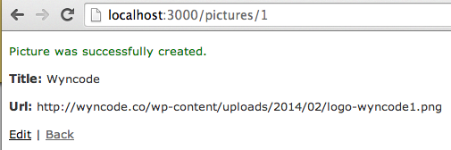

When I display the picture, I see the URL rather than the image. I need to use an image tag in the show view. So let’s fix that.

```html
# In app/views/pictures/show.html.erb

<p id="notice"><%= notice %></p>
<p>
  <strong>Title:</strong>
  <%= @picture.title %>
</p>
<p>
  <%= image_tag @picture.url %>
</p>

<%= link_to 'Edit', edit_picture_path(@picture) %> |
<%= link_to 'Back', pictures_path %>
```

My edits (in bold) removed the URL header and replaced the URL text with an image_tag. The image_tag method is a "view helper", a method that helps you generate HTML code. You could have accomplished the same thing using this line of code instead:

```html
">
```

But, in this case, the result is slightly more code for slightly less HTML. The image_tag helper produces this HTML:

```html

```

While writing HTML manually produces this:

```html

```

Letting Rails handle HTML-generation allows Rails to, for example, add an alt attribute to make your page more accessible. If more accessibility tags are recommended in the future (e.g. [https://developer.mozilla.org/en-US/docs/Web/Accessibility/ARIA](https://developer.mozilla.org/en-US/docs/Web/Accessibility/ARIA)), Rails will automatically add them for you if you use their helpers. Otherwise you have to do it yourself. So using the view helpers is recommended.

With this change to the show view, our Picture page looks better.

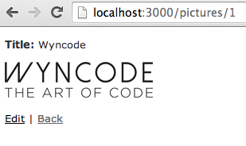

But the index page is still showing text URLs.

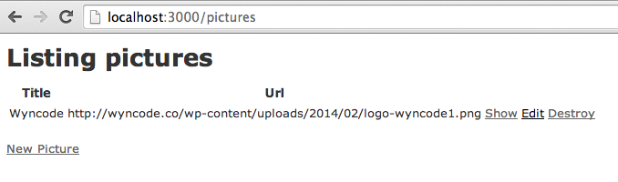

So we need to update the index view as well.

```html
 # In app/views/pictures/index.html.erb

<h1>Listing pictures</h1>
<table>
  <thead>
    <tr>
      <th>Title</th>
      <th>Url</th>
      <th colspan="3"></th>
    </tr>
  </thead>

  <tbody>
    <% @pictures.each do |picture| %>
      <tr>
        <td><%= picture.title %></td>
        <td><%= image_tag picture.url %></td>
        <td><%= link_to 'Show', picture %></td>
        <td><%= link_to 'Edit', edit_picture_path(picture) %></td>
        <td><%= link_to 'Destroy', picture, method: :delete, data: { confirm: 'Are you sure?' } %></td>
      </tr>
    <% end %>
  </tbody>
</table>

<br>
<%= link_to 'New Picture', new_picture_path %>
```

My edit (in bold) changes the text URL to an image_tag. Now my Picture list is working.

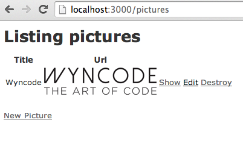

And that’s all you need to create your own photo hosting site. Obviously we’re cheating a bit here because we’re not allowing users to upload their own photos. We’re just displaying photos uploaded elsewhere. But this app gives you a great platform for coming up with some fancy designs or jQuery picture viewing effects. So have fun with it.

## Hard: Rainforest Project

We’re going to create an Amazon clone called Rainforest.

```sh
$ rails new rainforest
$ cd rainforest/
```
We need a site to manage products. A product should have a name, description, and a price (in total cents). Let’s create a scaffold for it.

```sh
$ rails g scaffold Product name description:text price_in_cents:integer --javascript-engine=js --stylesheet-engine=css

$ rake db:migrate
```

The name should be a string. But the description is a text. The "text" database type is appropriate for long-form text. The “string” is appropriate for short text, like names, titles, and labels.

The `price_in_cents` is an integer so we don’t have to deal with Float money side-effects.

The Product model should have some validations. We’d like to guarantee:

1. That the product’s name and description are not nil/null.
2. That the price is an integer > 0.

Let’s add those validations to the products model.

```ruby
# In app/models/product.rb

class Product < ActiveRecord::Base
  validates :description, :name, presence: true
  validates :price_in_cents, numericality: {only_integer: true, greater_than: 0}
end
```

We’re only validating these fields in Rails. We’re not validating in the database as well (but we should be!).

Now, when we try to create a bad product in the scaffold, this is what happens.

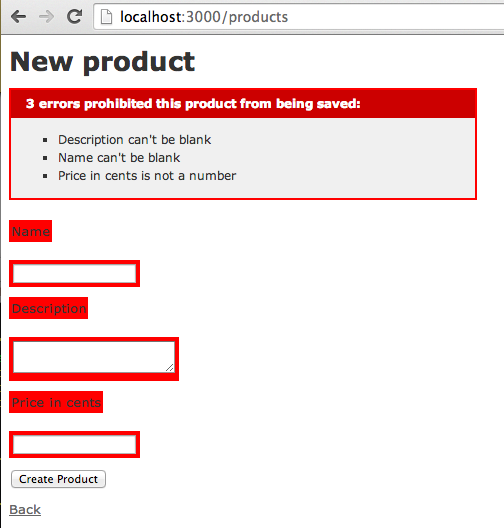

It’s a bloody mess. The scaffold translated the validation errors into red highlights and a big error message across the top of the page.

Let’s create a couple of valid products and check out the products list.

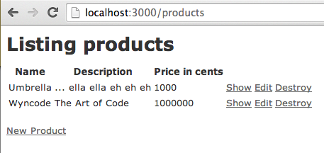

The price in cents is a weird thing to display. Let’s fix that.

There are three possible places to put this code: the model, the view, and the controller. In general, new code should always go in the model. Keep the controller and view "thin" and the model “fat”.

What we need in the product model is a way to generate a correctly formatted price.

```ruby
# In app/models/product.rb

class Product < ActiveRecord::Base
  validates :description, :name, presence: true
  validates :price_in_cents, numericality: {only_integer: true, greater_than: 0}

  def formatted_price
    price_in_dollars = price_in_cents.to_f / 100
    format("%.2f", price_in_dollars)
  end
end
```

The format method allows us to format the price with exactly 2 decimal points. With this method in place, we need to update both the index and show views to display the properly formatted price.

```html
# In app/views/products/index.html.erb

<h1>Listing products</h1>
<table>
  <thead>
    <tr>
      <th>Name</th>
      <th>Description</th>
      <th>**Price**</th>
      <th colspan="3"></th>
    </tr>
  </thead>

  <tbody>
    <% @products.each do |product| %>
      <tr>
        <td><%= product.name %></td>
        <td><%= product.description %></td>
        <td><%= **product.formatted_price** %></td>
        <td><%= link_to 'Show', product %></td>
        <td><%= link_to 'Edit', edit_product_path(product) %></td>
        <td><%= link_to 'Destroy', product, method: :delete, data: { confirm: 'Are you sure?' } %></td>
      </tr>
    <% end %>
  </tbody>
</table>

<br>

<%= link_to 'New Product', new_product_path %>
```

```html
# In app/views/products/show.html.erb

<p id="notice"><%= notice %></p>
<p>
  <strong>Name:</strong>
  <%= @product.name %>
</p>
<p>
  <strong>Description:</strong>
  <%= @product.description %>
</p>
<p>
  <strong>**Price**:</strong>
  <%= **@product.formatted_price** %>
</p>

<%= link_to 'Edit', edit_product_path(@product) %> |
<%= link_to 'Back', products_path %>
```

My edits are in bold. You can confirm that things are working correctly by refreshing the index and show views.

Products should have reviews, so let’s create those.

```sh
$ rails g scaffold review comment:text product:references --javascript-engine=js --stylesheet-engine=css
$ rake db:migrate
```

The scaffold creates /reviews routes. But reviews don’t make sense as their own thing. For example:

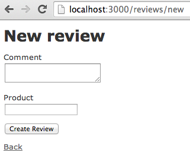

How do I create a new review? What do I put in the product field? I’ll have to lookup the id of a product. That’s annoying. Let’s fix that.

First, let’s add some associations to our models to make using them easier to use. The Review model is **already setup for us**.

```ruby
# In app/models/review.rb

class Review < ActiveRecord::Base
  belongs_to :product
end
```

The product model **needs a small update**.

```ruby
# In app/models/product.rb

class Product < ActiveRecord::Base
  validates :description, :name, presence: true
  validates :price_in_cents, numericality: {only_integer: true, greater_than: 0}
  has_many :reviews

  def formatted_price
    price_in_dollars = price_in_cents.to_f / 100
    sprintf("%.2f", price_in_dollars)
  end
end
```

So we’ve got our routes and models setup. Now it’s time to wire it all together. Let’s create some test data so we have something to play with.

First we’ll make some products. Just use the New Product link in the products scaffold ([http://localhost:3000/products](http://localhost:3000/products)).

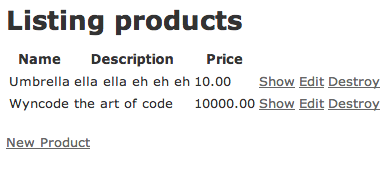

Next, let’s create some reviews in the reviews scaffold ([http://localhost:3000/reviews](http://localhost:3000/reviews)). The first product should be product_id 1 and the second product should be product_id 2.

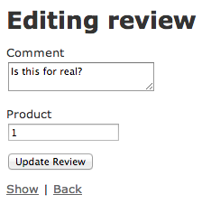

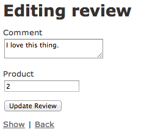

Reviews should be displayed in the context of a single product. So let’s update the product’s show view to display the associated reviews.

```html
# In app/views/products/show.html.erb

<p id="notice"><%= notice %></p>
<p>
  <strong>Name:</strong>
  <%= @product.name %>
</p>

<p>
  <strong>Description:</strong>
  <%= @product.description %>
</p>

<p>
<strong>Price:</strong>
<%= @product.formatted_price %>
</p>

<h3>Reviews</h3>
<% @product.reviews.each do |review| %>
  <p>
    <%= review.comment %>
    <br>
    Added on: <%= review.created_at %>
  </p>
<% end %>

<%= link_to 'Edit', edit_product_path(@product) %> |
<%= link_to 'Back', products_path %>
```

This update adds a section to the product’s show page containing a list of all of it’s reviews.

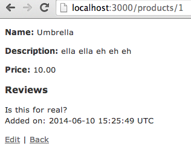

That wasn’t too bad. Now let’s make this interesting.

Our users will probably want some way to create a new review from the product page. So let’s see if we can borrow the "new review" form and drop it into this product page.

First we need to borrow the code from the reviews#new controller#action and add it to our products#show controller#action.

```ruby
app/controllers/products_controller.rb

  def show
    @review = Review.new
  end
  ```

Then we can borrow the reviews/new form and add it to our products/show view.

```html
# In app/views/products/show.html.erb

<h3>Reviews</h3>
<% @product.reviews.each do |review| %>
  <p>
    <%= review.comment %>
    <br>
    Added on: <%= review.created_at %>
  </p>
<% end %>

  <h3>New Review</h3>
<%= render 'reviews/form' %>

<%= link_to 'Edit', edit_product_path(@product) %> |
<%= link_to 'Back', products_path %>
```

This adds a "New Review" section to the product’s show page. This new section borrows the web form from the review’s “new” and “edit” pages. The reviews/form (short for app/views/reviews/\_form.html.erb) is a *view partial*. Partials are re-usable sections of web pages.

You may have noticed that, in a scaffold, the page for creating an object (new.html.erb) and updating an object (edit.html.erb) look very similar. In fact, the web form on both of those pages is exactly the same. Since Rails is brutally DRY, the Rails scaffold reuses a "\_form" view partial on both pages.

```html
# In app/views/reviews/new.html.erb

<h1>New review</h1>
<%= render 'form' %>

<%= link_to 'Back', reviews_path %>
```

```html
# In app/views/reviews/edit.html.erb

<h1>Editing review</h1>
<%= render 'form' %>

<%= link_to 'Show', @review %> |
<%= link_to 'Back', reviews_path %>
```

View partials can be distinguished from regular views by their filenames. View partials start with an underscore (\_).

```sh
$ ls app/views/reviews/
_form.html.erb		index.html.erb		new.html.erb		show.json.jbuilder
edit.html.erb		index.json.jbuilder	show.html.erb
```

Once we’ve added the review form view partial to the product’s show page, it should look like this.

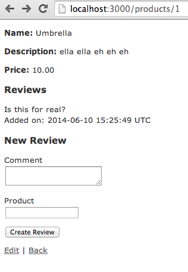

We’re not done yet. We still have a problem with that "Product" field. We don’t need it. The product is the page we’re currently looking at. So let’s disable it.

```html
# In app/views/reviews/_form.html.erb

  <div class="field">
    <%= f.label :comment %><br>
    <%= f.text_area :comment %>
  </div>

  <% if @product.nil? %>
    <div class="field">
      <%= f.label :product_id %><br>
      <%= f.text_field :product_id %>
    </div>

  <% else %>
    <%= f.label :product_id %><br>
    <%= f.text_field :product_id, disabled: true, value: @product.id %>

  <% end %>

  <div class="actions">
    <%= f.submit %>
  </div>
```

If we have an `@product` variable in our view, then show a disabled text_field with a default value. Otherwise, show a regular text_field. Now our product page looks like this.

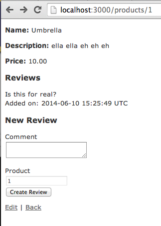

That product field is nice to have, but it’s not actually useful to the user. They don’t care about the product_id. So let’s hide it entirely.

```html
# In app/views/reviews/_form.html.erb

  <% if @product.nil? %>
    <div class="field">
      <%= f.label :product_id %><br>
      <%= f.text_field :product_id %>
    </div>
  <% else %>
    <%= f.hidden_field :product_id, value: @product.id %>
  <% end %>
```

A "hidden field" is a way of sneaking something into a web form without showing it to the user. We know it’s there, it’s in the HTML code, but it doesn’t get displayed to the user, which is exactly what we want.

Let’s try out this review form by entering some text and hitting the button.

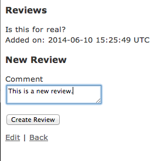

The review gets created.

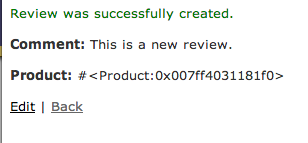

Unfortunately, the "back" button takes us back to the reviews index (/reviews) rather than the product page. A list of all the reviews on the site, outside the context of a single product, isn’t very useful. So let’s update that link to take us back to the product page instead.


That link is located on the review’s show page.

```html
# In app/views/reviews/show.html.erb


<p>
  <strong>Product:</strong>
  <%= @review.product %>
</p>

<%= link_to 'Edit', edit_review_path(@review) %> |

<% if @review.product.nil? %>
  <%= link_to 'Back', reviews_path %>

<% else %>
  <%= link_to 'Back', @review.product %>
<% end %>
```

Just like in the form partial, we want one thing to happen if we have a product defined, otherwise we’ll let the scaffold code run.

So let’s create some reviews and see what happens.

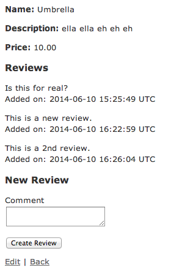

That’s looking good. It’s not pretty, but it works. One more thing then we’re done.


When we create a review, the product displayed is Ruby gibberish. We know what that is (a Ruby object), but your users don’t. So let’s fix that. That’s in the review’s "show" page.

```html
# In app/views/reviews/show.html.erb

<p>
  <strong>Product:</strong>
  <%= @review.product.name %>
</p>
```

Now when we create a review, the review page is cleaner.

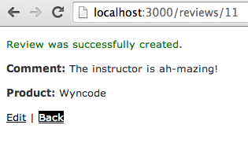

And when we click "Back", we’ll go to the product page instead of the review page.

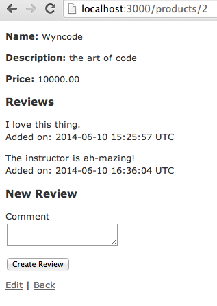

And we’re all done.

Here are some bonus goals, if you’re up for it:

* When I
    * try to create a review from the reviews index page (/reviews) and leave the product blank, or
    * edit a review

I get an error. Fix that error.


*TODO*:

[http://guides.rubyonrails.org/action_view_overview.html](http://guides.rubyonrails.org/action_view_overview.html)

Use **time_ago_in_words** view helper to display review.created_at.
