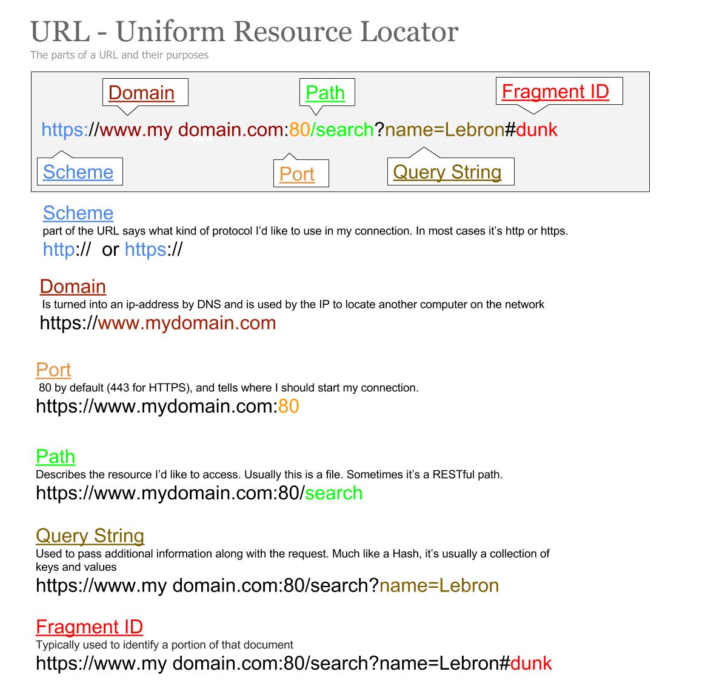

# URL Parser
In this project we will learn a variety of topics that range from test driven development to object oriented programming, and take a look ahead to some of next weeks topics.

### The Assignment
Before you go any further, take a look at the Url Parser Infographic to get a better grasp on the parts of a url.



The goal of the assignment is to be able to instantiate a new instance of the `UrlParser` class by passing it a string url, and then be able to access all of the parts of the url from that new object.

For example, I should be able to do the following:

- Instantiate a new instance of a `UrlParser`
```ruby
    github_url = UrlParser.new "https://github.com/search?q=ruby#stuff"
```
- Calling the following methods on _that_ instance should return the following results:
```bash
    github_url.scheme
    => "https"
    github_url.domain
    => "github.com"
    github_url.port
    => "443"
    github_url.path
    => "search"
    github.query_string
    => {"q" => "ruby"}
    github_url.fragment_id
    => "stuff"
```
- Pass all the provided rspec tests.

### Setting Up
- From the the terminal `cd` into your `wyncode` folder

- Once inside the `wyncode` folder, create the directory for your new project
```bash
    mkdir url_parser
    cd url_parser
```
- Now that you have an empty directory for your new project, we are going to set up the proper file structure. Inside of the `url_parser` folder, create a file named `url_parser.rb`
```bash
    touch url_parser.rb
```
- Great! Now lets create the `spec` folder for our test file, and `touch` the spec file inside that folder
```bash
    mkdir spec
    touch spec/url_parser_spec.rb
```

- Boom! We should have the proper directory structure set up for our project. Let's open our app in our text editor
```bash
    atom .
    #or subl .
```
- Next we need to copy the code from the file below into our `spec/url_parser_spec.rb` file.
 - [URL Parser Spec](https://github.com/wyncode/student-resources/blob/master/url-parser/url_parser_spec.rb)

### Getting Started

- Now that we have the rspec tests in the proper place we need to require the
`url_parser.rb` at the top of the spec file.

- Great! Now in your terminal run the tests by executing the command :
```bash
    rspec -fd -c
```
##### This should throw us an error `Uninitialized constant UrlParser(nameError)`. That's because we haven't made the `UrlParser` class yet in the `url_parser.rb` file.

- Create that class, run the spec again and we should see a bunch of failing tests!

- We're off to the races, now go write the code to make all those tests pass!  


### Advice
Good luck! Remember our process of red, green, refactor. Work on one test at a time,
get that spec to pass, then refactor. Then move on to the next test.

Oh, and do not change the tests!
